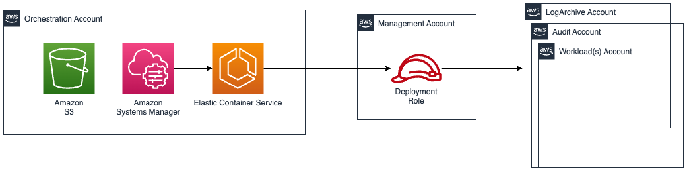

## Container Deployment

Landing Zone Accelerator on AWS (LZA) depends on services like AWS CodeBuild and AWS CodePipeline, which may not be available in all regions. In these regions, LZA can be deployed using Amazon Elastic Container Service (ECS). The services used in this deployment are primitives like Amazon ECS, Amazon S3, and AWS Systems Manager, which are available across all regions and partitions.

### Architecture



### Prerequisites

#### ECR Image

1. Create an [Amazon ECR](https://docs.aws.amazon.com/AmazonECR/latest/userguide/repository-create.html) repository in the orchestration account. We recommend it be named `landing-zone-accelerator-on-aws`
2. Download the tar file from the [GitHub repository](https://github.com/awslabs/landing-zone-accelerator-on-aws/releases/download/v1.15.0-experimental-rc.5/lza-v1.15.0-experimental-rc.5-al2023.tar.gz).
3. Authenticate your Docker client to the Amazon ECR registry to which you intend to push your image. Authentication tokens must be obtained for each registry used, and the tokens are valid for 12 hours. For more information, see [Private registry authentication in Amazon ECR](https://docs.aws.amazon.com/AmazonECR/latest/userguide/registry_auth.html).
```
aws ecr get-login-password --region <region> | docker login --username AWS --password-stdin <aws_account_id>.dkr.ecr.<region>.amazonaws.com
```
4. Load the docker image from Step 2.
```
docker load < lza-v1.15.0-rc.5-al2023.tar.gz
```
5. Tag the image
`docker tag lza-v1.15.0-rc.5-al2023:latest <aws_account_id>.dkr.ecr.<region>.amazonaws.com/landing-zone-accelerator-on-aws:latest`
6. [Push the image](https://docs.aws.amazon.com/AmazonECR/latest/userguide/docker-push-ecr-image.html)
```
docker push <aws_account_id>.dkr.ecr.<region>.amazonaws.com/landing-zone-accelerator-on-aws:latest
```


#### Cross-Account Setup

1. Enable [AWS Organizations](https://docs.aws.amazon.com/organizations/latest/userguide/orgs_manage_org.html) in the management account
2. Select an AWS account for the container deployment account. We recommend having the account as a member of the AWS Organizations environment.
3. Create a new IAM role in the AWS Organizations management account that allows access from the orchestration account. AWSAccelerator-ContainerDeploymentRole is the preferred name for this role.
4. Update the trust policy of the AWSAccelerator-ContainerDeploymentRole to allow access from the orchestration account:
```
 {
  "Version": "2012-10-17",		 	 	 
  "Statement": [
    {
      "Effect": "Allow",
      "Principal": {
        "AWS": "arn:${PARTITION}:iam::${ORCHESTRATION_ACCOUNT_ID}:root"
      },
      "Action": "sts:AssumeRole",
      "Condition": {
        "StringLike": {
          "aws:PrincipalArn": "arn:${PARTITION}:iam::${ORCHESTRATION_ACCOUNT_ID}:role/${AcceleratorQualifier}-*"
        }
      }
    }
  ]
}
```
5. Attach the AdministratorAccess AWS managed IAM policy to the role.

> Note: By default, AWS IAM roles with prefix AcceleratorQualifier in the pipeline account are used by AWS CodeBuild to assume role in the management account and deploy resources. To protect these roles, you should implement additional security measures, such as Service control policies (SCPs).


### Deploy Infrastructure

Launch the CloudFormation template (`AWSAccelerator-InstallerContainerStack.template.json`) in the orchestration account.

#### Template Parameters

| Parameter | Description | Default | Required |
|-----------|-------------|---------|----------|
| **Source Configuration** ||||
| EcrUri | The Amazon ECR repository URI where the LZA container image is stored | - | Yes |
| **Mandatory Accounts Configuration** ||||
| ManagementAccountEmail | The management (primary) account email. Must match the address in AWS Organizations | - | Yes |
| LogArchiveAccountEmail | The log archive account email | - | Yes |
| AuditAccountEmail | The security audit account email | - | Yes |
| **Environment Configuration** ||||
| ControlTowerEnabled | Select `Yes` if deploying to a Control Tower environment | `Yes` | No |
| AcceleratorPrefix | The prefix value for accelerator deployed resources. Cannot start with `aws` or `ssm`. Max 15 characters | `AWSAccelerator` | No |
| PythonRuntimeVersion | The Python runtime version for SSM Document `aws:executeScript` actions | `python3.11` | No |
| LogLevel | The log level for LZA engine (`error`, `info`, `debug`) | `error` | No |
| **Config Bucket Configuration** ||||
| UseExistingConfig | Select `Yes` to use an existing configuration bucket | `No` | No |
| ExistingConfigBucketName | Name of an existing LZA configuration bucket (required if `UseExistingConfig` is `Yes`) | - | Conditional |
| ExistingConfigBucketKey | Branch name of the existing configuration bucket key (required if `UseExistingConfig` is `Yes`) | - | Conditional |
| **Network Configuration** ||||
| UseExistingVpc | Select `Yes` to use an existing VPC | `No` | No |
| VpcCidr | The CIDR block for the VPC (used when `UseExistingVpc` is `No`) | `10.0.0.0/16` | No |
| ExistingVpcId | The ID of an existing VPC (required when `UseExistingVpc` is `Yes`) | - | Conditional |
| ExistingSubnetId | The ID of an existing subnet (required when `UseExistingVpc` is `Yes`) | - | Conditional |
| ExistingSecurityGroupId | The ID of an existing security group (required when `UseExistingVpc` is `Yes`) | - | Conditional |
| **Target Environment Configuration** ||||
| AcceleratorQualifier | Unique identifier for resources in the external deployment account. Must be lowercase alphanumeric with hyphens. Cannot be `aws-accelerator` | - | Yes |
| ManagementAccountId | Target management account ID | - | Yes |
| ManagementAccountRoleName | Target management account role name | - | Yes |

#### Validation Rules

- All three account emails (Management, Log Archive, Audit) must be unique
- When `UseExistingConfig` is `Yes`, both `ExistingConfigBucketName` and `ExistingConfigBucketKey` are required
- When `UseExistingVpc` is `Yes`, `ExistingVpcId`, `ExistingSubnetId`, and `ExistingSecurityGroupId` are required

#### Stack Outputs

| Output | Description |
|--------|-------------|
| DeploySolutionDocumentOutput | SSM Document name used to trigger automation for LZA engine using container |

### Use the Solution

Execute the automation using the [Systems Manager Automation document](https://docs.aws.amazon.com/systems-manager/latest/userguide/systems-manager-automation.html) created by the CloudFormation stack. The document name is available in the stack output `DeploySolutionDocumentOutput`.

#### Execution Steps

The SSM Automation document performs the following steps:

1. **RunTask** - Starts an ECS Fargate task in a private subnet that runs the LZA deployment container. The container executes the deployment script with your configured environment variables (account emails, prefix, config bucket, etc.)

2. **WaitForTaskCompletion** - Waits up to 12 hours for the ECS task to reach `STOPPED` status

3. **CheckTaskExitCode** - Verifies the container exit code. If non-zero, the automation fails and provides CloudWatch log location for troubleshooting

#### Automation Outputs

| Output | Description |
|--------|-------------|
| TaskArn | The ECS task ARN |
| ClusterName | The ECS cluster name |
| LogGroupName | CloudWatch log group for monitoring |
| LogStreamName | CloudWatch log stream for the specific task |
| ExitCode | Container exit code (0 = success) |
| StopCode | ECS task stop code |
| StopReason | Reason the task stopped |

#### Monitoring

Monitor deployment progress in real-time via [CloudWatch Logs](https://docs.aws.amazon.com/AmazonCloudWatch/latest/logs/WhatIsCloudWatchLogs.html) at:

```
/ecs/{AcceleratorQualifier}-lza-deployment
```

Replace `{AcceleratorQualifier}` with the value you provided during stack deployment.

### FAQs

**What are the minimum accounts required to deploy this solution?**

Orchestration account and [mandatory accounts](https://docs.aws.amazon.com/solutions/latest/landing-zone-accelerator-on-aws/mandatory-accounts.html) are required to deploy the solution.

**Can this be used in opt-in regions?**

Yes. To use this solution in opt-in regions, enable STS for that region using the following command in the initial accounts(initial accounts are described in question above):
```bash
aws account enable-region --region-name $region_name
```

Subsequent accounts added to the solution get opt-in regions without any manual intervention. 

**Is the container deployment at feature parity with CodePipeline?**

No. Currently, only deployment is supported without the ability to show a diff. The plan is to bring container deployment to feature parity with CodePipeline deployments.


### Known issues

**Account Name not found for [AccountName] Error**

##### Issue

When adding accounts that were created outside of the AWS Organization, the Landing Zone Accelerator engine fails with an error similar to:

```
Account Name not found for LogArchive.
```

##### Cause

This error occurs because the account has not yet been invited into the current AWS Organization. The engine cannot locate the account by name since it doesn't exist within the organization's account registry.

##### Resolution

In `accounts-config.yaml`, add the `accountIds` section to specify which accounts should be invited into the organization. This tells the engine which existing accounts to invite.

**Example:**

```yaml
accountIds:
  - email: logarchive@example.com ## based on example above 
    accountId: '000000000000'
  - email: audit@example.com ## other accounts that exist but not part of AWS Organizations
    accountId: '111111111111'
```

By adding the `accountIds` section with the email and accountId mappings, the engine knows to invite these existing accounts into the organization rather than expecting them to already be present.


**Why does my first-time deployment fail with "Failed to publish asset" or "Bucket exists, but we don't have access to it"?**

##### Issue

During first-time deployments, you may encounter an error like:

```
Failed to publish asset AWSAccelerator-LoggingStack-<ACCOUNT_ID>-<REGION>
Bucket named 'cdk-accel-assets-<MANAGEMENT_ACCOUNT_ID>-<REGION>' exists, but we dont have access to it.
```

##### Cause

This occurs due to IAM/S3 eventual consistency when cross-account permissions are first established. During initial bootstrap, member account deployment roles are created and the management account's S3 bucket policy is updated to allow cross-account access. Occasionally, these permissions aren't immediately effective when subsequent deployment stages attempt to publish assets.

##### Resolution

Retry the failed pipeline. On retry, all resources are already in place and the deployment will succeed.
