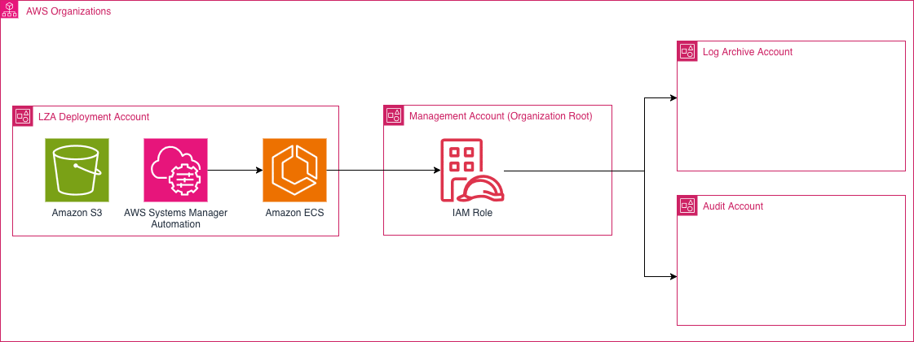

## LZA Container Deployment

Landing Zone Accelerator on AWS (LZA) depends on services like AWS CodeBuild and AWS CodePipeline, which may not be available in all AWS Regions. In these Regions, you can deploy LZA using Amazon Elastic Container Service (ECS). This deployment method uses foundational services like Amazon ECS, Amazon S3, and AWS Systems Manager, which are available across all Regions and partitions.

### Overview

The container deployment method follows a three-step process:

1. **Management Account Setup** - Configure AWS Organizations in your management account
2. **LZA Deployment Account Setup** - Create or configure the account where the LZA deployment infrastructure runs
3. **Deploy the Solution** - Deploy the installer stack to launch Landing Zone Accelerator

**Deployment Architecture:**

The LZA deployment account contains the orchestration infrastructure (Amazon ECS cluster, container image, AWS Systems Manager automation) that deploys and manages LZA resources in the management account and across your organization.



### Prerequisites

Before you begin the deployment, ensure you have the following resources available:

#### Required AWS Accounts

You need two AWS accounts to start:

1. **Management account** - AWS Organizations management account
2. **LZA Deployment account** - Hosts the deployment infrastructure (new or existing account)

The LZA installer stack automatically creates the **Log Archive** and **Audit** accounts during installation.

> **Note:** If you have existing standalone accounts you want to use for Log Archive or Audit accounts, see the FAQ section [Can I use existing standalone accounts?](#can-i-use-existing-standalone-accounts)

---

#### Management Account

- Enable [AWS Organizations](https://docs.aws.amazon.com/organizations/latest/userguide/orgs_manage_org.html) with all features in the management account

---

#### LZA Deployment Account

To set up the LZA deployment account, choose one of the following options:

**Option 1: Create a New Account (Recommended)**
- [Create a member account](https://docs.aws.amazon.com/organizations/latest/userguide/orgs_manage_accounts_create.html#orgs_manage_accounts_create-new) in AWS Organizations

> **Note:** During account creation, specify the IAM role name based on your deployment type:
> - For Control Tower deployments: Use `AWSControlTowerExecution`
> - For Organizations-only deployments: Use `OrganizationAccountAccessRole` (this is also the default if you don't specify a name)

**Option 2: Use an Existing Account Created Outside AWS Organizations**
- [Invite the account to join your organization](https://docs.aws.amazon.com/organizations/latest/userguide/orgs_manage_accounts_invites.html)
- Accept the organization invitation from the existing account
- [Create an IAM role](https://docs.aws.amazon.com/organizations/latest/userguide/orgs_manage_accounts_create-cross-account-role.html) in the existing account with a trust policy to the management account. Use the role name based on your deployment type:
  - For Control Tower deployments: `AWSControlTowerExecution`
  - For Organizations-only deployments: `OrganizationAccountAccessRole`

---

#### Cross-Account IAM Role Setup

1. Sign in to the management account
2. Create a new IAM role in the management account that allows access from the LZA deployment account. `AWSAccelerator-ContainerDeploymentRole` is the preferred name for this role
3. Update the trust policy of the `AWSAccelerator-ContainerDeploymentRole` to allow access from the LZA deployment account:

```json
{
  "Version": "2012-10-17",
  "Statement": [
    {
      "Effect": "Allow",
      "Principal": {
        "AWS": "arn:${PARTITION}:iam::${LZA_DEPLOYMENT_ACCOUNT_ID}:root"
      },
      "Action": "sts:AssumeRole",
      "Condition": {
        "StringLike": {
          "aws:PrincipalArn": "arn:${PARTITION}:iam::${LZA_DEPLOYMENT_ACCOUNT_ID}:role/${AcceleratorQualifier}-*"
        }
      }
    }
  ]
}
```

Replace `${PARTITION}` with your AWS partition (for example, `aws`, `aws-us-gov`, `aws-cn`, `aws-eusc`), `${LZA_DEPLOYMENT_ACCOUNT_ID}` with your LZA deployment account ID, and `${AcceleratorQualifier}` with your chosen accelerator qualifier.

4. Attach the `AdministratorAccess` AWS managed IAM policy to the role

> **Note:** By default, IAM roles with the `AcceleratorQualifier` prefix in the LZA deployment account are used by ECS tasks to assume the role in the management account and deploy resources. To protect these roles, you should implement additional security measures, such as AWS Organizations service control policies (SCPs).

---

#### Container Image

The LZA container image is publicly available in the [AWS Solutions Public ECR Gallery](https://gallery.ecr.aws/aws-solutions/landing-zone-accelerator-on-aws). The AWS CloudFormation template is pre-configured to use the correct public image for the solution version.

**Public ECR Repository:** `public.ecr.aws/aws-solutions/landing-zone-accelerator-on-aws`

**Using the Default Public Image:**

When deploying the AWS CloudFormation template, you can use the default value for the `ImageUri` parameter to automatically use the public image for this version.

**Container Image Customization:**

If you need to customize the container image, you can build and host it in your own Amazon ECR repository:

1. The container resources are located in `container/build/`
2. Build the Docker image using the Dockerfile in that directory
3. Push the image to your private or public Amazon ECR repository
4. When deploying the AWS CloudFormation template, provide your full image URI (including tag) in the `ImageUri` parameter

For more information on Amazon ECR:
- [Private repositories and images](https://docs.aws.amazon.com/AmazonECR/latest/userguide/Repositories.html)
- [Public repositories and images](https://docs.aws.amazon.com/AmazonECR/latest/public/public-repositories.html)


### Deploy the Solution

To deploy the solution, complete the following steps:

1. Sign in to the **AWS Management Console** in the LZA deployment account

2. Navigate to the AWS CloudFormation console

3. On the **Create stack** page, verify that the correct template URL is in the **Amazon S3 URL** text box and choose **Next**.

> **Note:** The template URL will be updated with the S3 bucket link hosting the container installer stack before release. For testing purposes, navigate to [Tags](https://gitlab.aws.dev/landing-zone-accelerator/landing-zone-accelerator-on-aws/-/tags), select the tag ID, select Pipelines, choose container-installer, download the stack template, and upload the template file to CloudFormation.

4. On the **Specify stack details** page, assign a name to your solution stack (recommended: `AWSAccelerator-InstallerContainerStack`)

5. Under **Parameters**, review and modify the following values:

#### Template Parameters

| Parameter | Default | Description |
|-----------|---------|-------------|
| **Source Configuration** |||
| ImageUri | `public.ecr.aws/aws-solutions/landing-zone-accelerator-on-aws:1.15.0-rc.10` | The Amazon Elastic Container Registry (Amazon ECR) repository, where Landing Zone Accelerator on AWS code is present. |
| **Mandatory Accounts Configuration** |||
| ManagementAccountEmail | `<requires input>` | The management (primary) account email - NOTE: This must match the address of the management account email as listed in AWS Organizations > AWS accounts. |
| LogArchiveAccountEmail | `<requires input>` | The log archive account email |
| AuditAccountEmail | `<requires input>` | The security audit account (also referred to as the audit account) |
| LzaDeploymentAccountEmail | `<requires input>` | Landing Zone Accelerator on AWS Deployment account email - NOTE: This must match the address of the account email that you are deploying from. |
| **Environment Configuration** |||
| ControlTowerEnabled | `Yes` | Select yes if deploying to a Control Tower environment. Select no if using just Organizations. If no, you must first set up mandatory accounts. |
| AcceleratorPrefix | `AWSAccelerator` | The prefix value for accelerator deployed resources. Leave the default value if using solution defined resource name prefix, the solution will use AWSAccelerator as resource name prefix. Note: Updating this value after initial installation will cause stack failure. Non-default value can not start with keyword "aws" or "ssm". Trailing dash (-) in non-default value will be ignored. |
| PythonRuntimeVersion | `python3.11` | The Python runtime version for SSM Document aws:executeScript actions. Must match SSM supported runtimes (e.g., python3.8, python3.9, python3.10, python3.11). |
| LogLevel | `error` | The log level for LZA engine. Controls the verbosity of logs generated during deployment. |
| **Config Bucket Configuration** |||
| UseExistingConfig | `No` | Select Yes if deploying the solution with an existing configuration. Leave the default value if using the solution-deployed bucket. If the AcceleratorPrefix parameter is set to the default value, the solution will deploy a bucket named "aws-accelerator-config-$account-$region." Otherwise, the solution-deployed bucket will be named "AcceleratorPrefix-config-$account-$region." Note: Updating this value after initial installation may cause adverse affects. |
| ExistingConfigBucketName | `<optional input>` | The name of an existing LZA configuration bucket hosting the accelerator configuration. |
| ExistingConfigBucketKey | `<optional input>` | Specify the branch name of the existing LZA configuration bucket key to pull the accelerator configuration from. |
| **Network Configuration** |||
| VpcCidr | `10.0.0.0/16` | The CIDR block for the VPC (used when UseExistingVpc is No) |
| UseExistingVpc | `No` | Select Yes to use an existing VPC. If Yes, provide existing subnet and security group IDs. |
| ExistingVpcId | `<optional input>` | The ID of an existing VPC (required when UseExistingVpc is Yes) |
| ExistingSubnetId | `<optional input>` | The ID of an existing subnet (required when UseExistingVpc is Yes) |
| ExistingSecurityGroupId | `<optional input>` | The ID of an existing security group (required when UseExistingVpc is Yes) |
| **Target Environment Configuration** |||
| AcceleratorQualifier | `<requires input>` | Names the resources in the external deployment account. This must be unique for each LZA pipeline created in a single external deployment account, for example "env2" or "app1." Do not use "aws-accelerator" or a similar value that could be confused with the prefix. |
| ManagementAccountId | `<requires input>` | Target management account id |
| ManagementAccountRoleName | `<requires input>` | Target management account role name |

6. Choose **Next**.

7. On the **Configure stack options** page, choose **Next**.

8. On the **Review and create** page, review and confirm the settings. Select the box acknowledging that the template might create IAM resources.

9. Choose **Submit** to deploy the stack.

10. You can view the status of the stack in the AWS CloudFormation console in the **Status** column. You should receive a **CREATE_COMPLETE** status in approximately 10-15 minutes.

#### Validation Rules

- All four account emails (Management, Log Archive, Audit, LZA Deployment) must be unique
- When `UseExistingConfig` is `Yes`, both `ExistingConfigBucketName` and `ExistingConfigBucketKey` are required
- When `UseExistingVpc` is `Yes`, `ExistingVpcId`, `ExistingSubnetId`, and `ExistingSecurityGroupId` are required
- `AcceleratorQualifier`, `ManagementAccountId`, and `ManagementAccountRoleName` must not be empty

#### Stack Outputs

| Output | Description |
|--------|-------------|
| DeploySolutionDocumentOutput | SSM Document name used to trigger automation for LZA engine using container |

### Use the Solution

Execute the automation using the [Systems Manager Automation document](https://docs.aws.amazon.com/systems-manager/latest/userguide/systems-manager-automation.html) created by the CloudFormation stack. The document name is available in the stack output `DeploySolutionDocumentOutput`.

#### Execution Steps

The SSM Automation document performs the following steps:

1. **RunTask** - Starts an ECS Fargate task in a private subnet that runs the LZA deployment container. The container executes the deployment script with your configured environment variables (account emails, prefix, config bucket, etc.)

2. **WaitForTaskCompletion** - Waits up to 12 hours for the ECS task to reach `STOPPED` status

3. **CheckTaskExitCode** - Verifies the container exit code. If non-zero, the automation fails and provides CloudWatch log location for troubleshooting

#### Automation Outputs

| Output | Description |
|--------|-------------|
| TaskArn | The ECS task ARN |
| ClusterName | The ECS cluster name |
| LogGroupName | CloudWatch log group for monitoring |
| LogStreamName | CloudWatch log stream for the specific task |
| ExitCode | Container exit code (0 = success) |
| StopCode | ECS task stop code |
| StopReason | Reason the task stopped |

#### Monitoring

Monitor deployment progress in real-time via [CloudWatch Logs](https://docs.aws.amazon.com/AmazonCloudWatch/latest/logs/WhatIsCloudWatchLogs.html) at:

```
/ecs/{AcceleratorQualifier}-lza-deployment
```

Replace `{AcceleratorQualifier}` with the value you provided during stack deployment.

### FAQs

#### What are the minimum accounts required to deploy this solution?

Management and LZA deployment accounts are required to deploy the solution. The solution automatically creates the [mandatory accounts](https://docs.aws.amazon.com/solutions/latest/landing-zone-accelerator-on-aws/mandatory-accounts.html) (Log Archive and Audit) during installation.

#### Can this be used in opt-in regions?

Yes. To use this solution in opt-in Regions, enable STS for that Region using the following command in the initial accounts (Management and LZA deployment accounts):
```bash
aws account enable-region --region-name $region_name
```

Subsequent accounts added to the solution get opt-in regions without any manual intervention.

#### Is the container deployment at feature parity with CodePipeline?

No. Currently, only deployment is supported without the ability to show a diff. The plan is to bring container deployment to feature parity with CodePipeline deployments.

#### Can I use existing standalone accounts?

Yes. Use newly created or empty accounts. Pre-existing resources in accounts can cause conflicts and require individual evaluation. Existing accounts must not be part of another AWS Organization.

Choose one of the following options:

**Option 1: Invite accounts manually before deployment**

Complete the following steps before deployment:
1. Invite the account to your organization
2. Accept the invitation
3. Create the appropriate IAM role in the account with a trust policy to the management account:
   - For Control Tower deployments: `AWSControlTowerExecution`
   - For Organizations-only deployments: `OrganizationAccountAccessRole`

**Option 2: Let LZA invite accounts during deployment**

Add the accounts to the `accountIds` section of your `accounts-config.yaml` file:

```yaml
accountIds:
  - email: account1@example.com
    accountId: '111111111111'
```

Before deployment, ensure the appropriate IAM role exists in each account with a trust policy to the management account:
- For Control Tower deployments: `AWSControlTowerExecution`
- For Organizations-only deployments: `OrganizationAccountAccessRole`


### Known issues

#### Account Name not found for [AccountName] Error

##### Issue

When adding accounts that were created outside of the AWS Organization, the Landing Zone Accelerator engine fails with an error similar to:

```
Account Name not found for LogArchive.
```

##### Cause

This error occurs because the account has not yet been invited into the current AWS Organization. The engine cannot locate the account by name since it doesn't exist within the organization's account registry.

##### Resolution

In `accounts-config.yaml`, add the `accountIds` section to specify which accounts should be invited into the organization. This tells the engine which existing accounts to invite.

**Example:**

```yaml
accountIds:
  - email: logarchive@example.com ## based on example above
    accountId: '000000000000'
  - email: audit@example.com ## other accounts that exist but not part of AWS Organizations
    accountId: '111111111111'
```

By adding the `accountIds` section with the email and accountId mappings, the engine knows to invite these existing accounts into the organization rather than expecting them to already be present.


#### Why does my first-time deployment fail with "Failed to publish asset" or "Bucket exists, but we don't have access to it"?

##### Issue

During first-time deployments, you may encounter an error like:

```
Failed to publish asset AWSAccelerator-LoggingStack-<ACCOUNT_ID>-<REGION>
Bucket named 'cdk-accel-assets-<MANAGEMENT_ACCOUNT_ID>-<REGION>' exists, but we don't have access to it.
```

##### Cause

This occurs due to IAM/S3 eventual consistency when cross-account permissions are first established. During initial bootstrap, member account deployment roles are created and the management account's S3 bucket policy is updated to allow cross-account access. Occasionally, these permissions aren't immediately effective when subsequent deployment stages attempt to publish assets.

##### Resolution

Retry the failed automation. On retry, all resources are already in place and the deployment will succeed.
