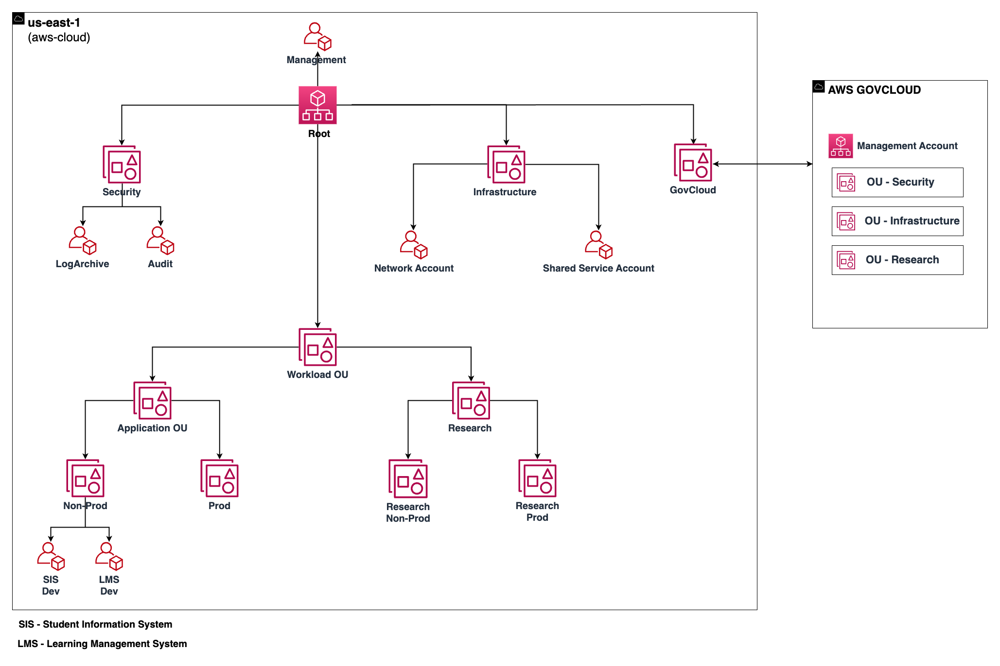

# Education Landing Zone Accelerator

## Overview

**The Landing Zone Accelerator (LZA)** for Education is an industry specific deployment of the [Landing Zone Accelerator on AWS](https://aws.amazon.com/solutions/implementations/landing-zone-accelerator-on-aws/) solution architected to align with AWS best practices and in conformance with multiple, global compliance frameworks. Built on top of the standard AWS Control Tower accounts, namely `Management`, `Audit`, and `LogArchive`, the LZA for Education deploys additional resources that helps establish platform readiness with security, compliance, and operational capabilities. It is important to note that the Landing Zone Accelerator solution will not, by itself, make you compliant. It provides the foundational infrastructure from which additional complementary solutions can be integrated. You must review, evaluate, assess, and approve the solution in compliance with your organization’s particular security features, tools, and configurations.

## Security Frameworks

The education industry is high regulated. The LZA for Education provides additional guardrails to help mitigate against the threats faced by education customers. The LZA for Education is not meant to be feature complete for fully compliant, but rather is intended to help accelerate cloud migrations and cloud refactoring efforts by organizations serving the education industry. While much effort has been made to reduce the effort required to manually build a production-ready infrastructure, you will still need to tailor it to your unique business needs.

This solution includes controls from frameworks in various geographies, including `HIPAA`, `ITAR`, `NIST 800-171`, and `CMMC`. If you are deploying the Landing Zone Accelerator on AWS for Education solution, please consult with your AWS team to understand controls to meet your requirements.

>**Note**: Some compliance requirements may need to be met through our AWS GovCloud Regions. 

## Security Controls
Security controls are set in place as protection against human error and safe guards from inadvertent actions within the AWS environment. These controls take the form of AWS Config rules and Service Control Policies (SCPs). The file `organization-config.yaml` provides detailed information surrounding the declaration of SCPs, Tagging Policies, and Backup Policies. SCPs can be as general or as specific as needed. Each SCP workload is able to be customized to meet organization requirements. Below are sample policies provided for a few specific use cases:

* **Service Control Policies**: Service control policies have been provided in `service-control-policies/guardrails-1.json` and `service-control-policies/guardrails-2.json`, that prevent changes to and deletion of policies which control IAM policy creation, Lambda permissions, mapping, CloudWatch Logs retention policy and KMS key disassociation to name a few. These services and their correct configuration are vital for OUs such as that of the Department Information System, where user access and IAM policies have strict requirements.
* **Tagging Policies**: A sample tagging policy has been provided in `tagging-policies/org-tag-policy.json` showing how you can further extend these policies to define `Environment Type` for `Prod`, `QA`, `Dev` workloads, and `Data Classification` to track sensitive and non-sensitive workloads. For OUs such as Student Health Services, for example. As well as how to enforce them to specific AWS services. The sample policy can be edited to reflect your organizations departments and their unique needs, such that resources provisioned by the LZA are automatically tagged in accordance with your business requirements.
* **Backup Policies**: A sample backup policy has been provided in `backup-policies/org-backup-plan.json` as an example for how backups can be scheduled along with lifecycle and retention management settings. This policy can directly enable OUs, such as those responsible for Student Financial Aid and that of the Bursar, to specify data retention policies and the frequency of backups, in order to comply with **Federal Student Aid (FSA)** third party auditing requirements, for example.

The `security-config.yaml` file can be used to configure AWS services such as AWS Config, AWS Security Hub, and to enable storage encryption. Additional alarms and metrics have been provided to inform you of actions within your AWS Cloud environment.  

The `global-config.yaml` file contains settings that enable regions, centralized logging using AWS CloudTrail and Amazon CloudWatch Logs and the retention period for those logs to help you meet your monitoring needs.
 
You are able to review these settings to determine parts of the configuration that may need to be altered to fit your specific requirements.

> **Note**: the specific file locations are subject to update as the EDU LZA team continues to build out the solution.

## Organizational Structure

Education LZA accounts are generated and organized as follows:

In the Education LZA Organization Structure, the Workload Organization Unit(OU) represents the logical construct where workloads for the institution will reside. It’s broken down further into an Application OU and a Research OU. There are sub-OUs in the Application OU for non-production and production, and these contain accounts for various workloads such as SIS Dev and LMS Dev. Then there’s a Research OU where highly sensitive and regulated research initiatives will live, either in non-production or production. This OU structure is provided to you. However, you are free to change the organizational structure, organizational units (OUs), and accounts to meet your specific needs. For additional information about how to best organize your AWS OU and account structure, please reference the recommended OUs and accounts in the [For further consideration](#for-further-consideration) section below as you begin to experiment with the LZA for Education.

> **Compliance Use Case:** The Applications OU and Research OU can be used for compliance such as 800-171/HIPAA/CMMC Level 1-2, while GovCloud can be used for ITAR.

## Architecture Diagrams
AWS LZA for Education Organizational Structure

By default, the LZA for Healthcare builds the above organizational structure, with the exception of the `Management` and `Security` OU, which are predefined by you prior to launching the LZA. The below architecture diagram highlights the key deployments:

* **A Workload OU**
    * Contains one `Prod` and `Non-Prod` OU with several account for various workloads
    * Each contains a single VPC
    * Each VPC uses a /16 CIDR block in the 10.0.0.0/8 RFC-1918 range

* **An Infrastructure OU**
    * Contains one `Network` and one `SharedServices` Account
    * The `Network` account also contains a Transit Gateway for infrastructure routing
    * Each contains a single VPC
    * Each VPC uses a /22 CIDR block in the 10.0.0.0/8 RFC-1918 range

## Cost
You are responsible for the cost of the AWS services used while running this solution. As of `October 2022`, the cost for running this solution using the Landing Zone Accelerator with the education configuration files and AWS Control Tower in the US East (N. Virginia) Region within a test environment with no active workloads is between $500-$1,000 USD per month. As additional AWS services and workloads are deployed, the cost will increase. Central Inspection is recommended with the AWS Network Firewall. This provides necessary protection from attacks and minimizing the impact surface area, which is a core part for improving your overall security posture.

| AWS Service      | Cost per month |
| ---------------- | ----------- |
| AWS CloudTrail  | $43.50 |
| Amazon Config | $325.02 |
| Amazon AWS Key Management Services (AWS KMS) | $64.47 |
| Amazon Kinesis | $24.27 |
| Amazon Kinesis Data Firehose | $0.79 |
| Amazon Simple Storage Service (Amazon S3) | $3.15 |
| Amazon Virtual Private Cloud (Amazon VPC)| $65.73 |
| AWS Network Firewall | $227.92 |
| **Total Monthly Cost** | **$755.01** |

> **Note**: We recommend creating a budget through AWS Cost Explorer to help manage costs. Prices are subject to change. For full details, refer to the pricing webpage for each AWS service used in this solution.

## For further consideration

This is a baseline for Education Landing Zone Accelerate consisting of best practices. It is a *starting point* for you to use, as you align your organization objectives and tailor to your specific business requirements. AWS provides resources for you to consult with, as you begin customizing your deployment of Education LZA: 

1. This set of configuration files was tested with AWS Control Tower versions 3.0. AWS Control Tower 3.0 supports the use of an AWS CloudTrail Organization Trail. The global-config.yaml file shows organizationTail set to false because it is enabled through the AWS Control Tower setup.
1. Refer to the [Best Practices](https://aws.amazon.com/blogs/mt/best-practices-for-organizational-units-with-aws-organizations/) for Organizational Units with AWS Organizations blog post for an overview.
1. Review [AWS Organizations in AWS GovCloud](https://aws.amazon.com/blogs/security/aws-organizations-available-govcloud-regions-central-governance-management-accounts/) blog for guidance on central governance and management of AWS accounts in GovCloud.
1. LZA on AWS is architected to support and accelerate DoD [CMMC ](https://aws.amazon.com/compliance/cmmc/)(Cybersecurity Maturity Model Certification) readiness.
1. [Recommended OUs and accounts](https://docs.aws.amazon.com/whitepapers/latest/organizing-your-aws-environment/recommended-ous-and-accounts.html). This section of the `Organizing your AWS Environment Using Multiple` Accounts Whitepaper discusses the deployment of specific-purpose OUs in addition to the foundational ones established by the LZA. For example, you may wish to establish a `Sandbox` OU for experimentation, a `Policy Staging` OU to safely test policy changes before deploying them more broadly, or a `Suspended` OU to hold, constrain, and eventually retire accounts that you no longer need.
1. [AWS Security Reference Architecture (SRA) ](https://docs.aws.amazon.com/prescriptive-guidance/latest/security-reference-architecture/welcome.html). The SRA "is a holistic set of guidelines for deploying the full complement of AWS security services in a multi-account environment." This document helps you to explore the "big picture" of AWS security and security-related services in order to determine the architectures most suited to your organization's unique security requirements.
1. Transit Gateway Flow logs are not enabled by default, you will need to work with AWS teams to determine if enabling TGW Flow logs helps you to meet your regulatory and organizational requirements.

## References

* LZA on AWS [Implementation Guide](https://docs.aws.amazon.com/solutions/latest/landing-zone-accelerator-on-aws/landing-zone-accelerator-on-aws.pdf). This is the official documentation of the Landing Zone Accelerator Project and serves as your starting point. Use the instructions in the implementation guide to stand up your environment and then return to this project for Healthcare-specific customization.
* AWS Labs [LZA Accelerator](https://github.com/awslabs/landing-zone-accelerator-on-aws) GitHub Repository. This is the official codebase of the Landing Zone Accelerator Project. 

