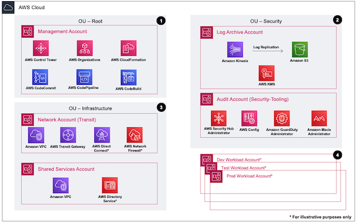

# Landing Zone Accelerator on AWS for Elections 

## Overview

The Landing Zone Accelerator (LZA) for Elections aims to produce a reference Architecture for use by elections customers such as Committees and Campaigns, Federal, State, and Local elections agencies, and Independent Software Vendors who produce solutions for elections customers.  Built on top of the standard AWS Control Tower accounts, namely `main`, `audit`, and `log archive`, the Elections LZA deploys additional resources that model typical workload architectures.

As the Elections ecosystem is not heavily regulated, for example such as the financial or healthcare industries, this project builds around best practices suitable for any organization.  It provides additional guardrails to help mitigate against the unique threats faced by elections customers.  The Elections LZA is not meant to be feature complete, but rather is intended to help accelerate cloud migrations and cloud refactoring efforts by organizations focused on election workloads.  You will still need to tailor it to your unique business needs, however it does reduce much of the effort required to manually build a production-ready infrastrcture.

## Deployment Overview

Use the following steps to deploy the industry guidance. For detailed instructions, follow the links for each step.

[Step 1. Launch the stack](https://docs.aws.amazon.com/solutions/latest/landing-zone-accelerator-on-aws/step-1.-launch-the-stack.html)

* Launch the AWS CloudFormation template into your AWS account.
* Review the templates parameters and enter or adjust the default values as needed.

[Step 2. Await initial environment deployment](https://docs.aws.amazon.com/solutions/latest/landing-zone-accelerator-on-aws/step-2.-await-initial-environment-deployment.html)

* Await successful completion of `AWSAccelerator-Pipeline` pipeline.

Step 3. Copy the configuration files

* Clone the `aws-accelerator-config` AWS CodeCommit repository.
* Clone the [landing-zone-accelerator-on-aws](https://github.com/awslabs/landing-zone-accelerator-on-aws) repo
* Copy the configs and all the contents from the `aws-best-practices` folder under `reference/sample-configurations` to your local `aws-accelerator-config` repo.
* Copy the contents from the `aws-best-practices-elections-us` folder under `reference/sample-configurations` to your local `aws-accelerator-config` repo.  You may be prompted to over-write duplicate configs, such as `accounts-config.yaml`.

Step 4. Update the configuration files and release a change.

* Using the IDE of your choice.  Update the `homeRegion` variable at the top of each config to match the region you deployed the solution to.
* Update the configuration files to match the desired state of your environment. Look for the `UPDATE` comments for areas requiring updates, such as e-mail addresses in your `accounts-config.yaml`
* Review the contents in the `Security Controls` section below to understand if any changes need to be made to meet organizational requirements, such as applying SCPs to the various OUs.
* Commit and push all your change to the `aws-accelerator-config` AWS CodeCommit repository.
* Release a change manually to the AWSAccelerator-Pipeline pipeline.

## Organizational Structure

Landing Zone Accelerator on AWS (LZA) for Elections accounts are generated and organized as follows:

```sh
+-- Root
|   +-- Security
|       +-- Log Archive
|       +-- Audit
|   +-- Workloads
|       +-- Development
|       +-- Production
|   +-- Infrastructure
|       +-- Network
|       +-- Shared Services
|   +-- Management Account
```

You are free, of course, to change the organizational structure, Organizational Units (OU), and accounts to meet your specific needs.  Please consult the ["For further consideration"](#for-further-consideration) section below as you begin to experiment with the Elections LZA.

## Architecture Diagram

By default the Landing Zone Accelerator on AWS (LZA) for Elections builds the above organizational structure, with the exception of the `Management Account` and `Security` OUs, which are predefined by you prior to launching the LZA.  The below architecture diagram highlights the key deployments:

* A `Workloads` OU
  * Contains one `Production` and one `Development` Account
  * Refer to the `network-config.yaml` file for examples to customize your VPCs and networks.
  * No VPCs are configured in this OU by default; you will need to define them based on your requirements.
* An `Infrastructure` OU
  * Contains one `Network` and one `SharedServices` Account
  * The `Network` account also contains a Transit Gateway for infrastructure routing

Below is a reference architecture diagram from the LZA [Architecture overview] documentation which discusses organizational account structure best practices:



The accounts in the `Workloads` OU represent a standard infrastructure for development or production deployment of your workloads.  The `Infrastructure` OU provides the following specialized functions:

* The `Network` account provides an AWS Transit Gateway for routing traffic between accounts and, potentially, to and from the Internet.  It also includes a Network Inspection VPC for permiter defenses, such as firewalls or third-party IPS/IDS solutions.
* The `Shared Services` account is intended to house centrally-shared services that are accessible to all of the accounts in your infrastructure.  For example, you might deploy an Internet Gateway here for external access, or a central directory service such as LDAP or Active Directory.

Please additionally review the reference network diagram for an overview of the topology provided by the default implementation.  It contains several commented-out examples which you may wish to customize via the `network-config.yaml` file to meet your orgnization's requirements:


## Security Controls

Within the file `organization-config.yaml` are sections for declaring Service Control Policies (SCPs), Tagging Policies, and Backup Policies.  Links to relevant documentation are provided within each section.

### Service Control Policies

An example SCP, `service-control-policies/deny-non-us-regions.json`, is included which prohibits resources from being launched in non-US regions.  For wider adoption it is recomended to modify this SCP to meet your needs.  The example policy allows resources only in the four commercial US regions (us-east-1, us-east-2, us-west-1, us-west-2) or two GovCloud regions (us-gov-east-1, us-gov-west-1).  As defined, the policy makes exceptions for global services that would otherwise fail if explicitly denied.

While not included, it is also possible to define an exception condition; e.g. to allow a specific role to bypass these restrictions via `Condition` -> `ArnNotLike` -> `aws:PrincipalARN`.  Such exceptions are an exercise left to the reader.

Additional SCPs which adhere to generally accepted security best practices are also included by default, via `service-control-policies/guardrails-1.json` and `service-control-policies/guardrails-2.json`.  Please refer to the [SCP documentation] and [SCP examples] pages for further information.

### Tagging Policies

A sample Tagging Policy has been provided in `tagging-policies/elections-tag-policy.json` and customized slightly to reflect the types of `Cost Centers` typically associted with an Election organization; for example `Campaign budget` and `In-kind contribution`.  The sample policy should be edited to reflect your own organization's cost centers so that resources provisioned by the LZA are automatically tagged in accordance with your business requirements.  Please refer to the [Tagging policies] documentation for further information and usage guidelines.

### Backup Policies

A basic, best-practice organization-wide backup policy has been provided in `backup-policies/org-backup-policies`. This policy has rules for daily, weekly, monthly, quarterly (90 day), and annual backup schedules, including lifecycle configurations governing when to move backups to cold storage and when to delete backups.

This policy is **disabled by default** because the configuration choices made should be **deliberate**, both due to cost considerations, and especially due to any legal obligations regarding retention policies.  For example, the default setting for `delete_after_days` is 1095 days, or 3 years.  Before enabling this policy, ensure that `delete_after_days` meets your organization's records retention policies.  Similarly, ensure that `move_to_cold_storage_after_days` meets business requirements.  Please refer to the [Backup policies] documentation prior to enabling backup policies.

## For further consideration

Although the Landing Zone Accelerator on AWS (LZA) for Elections aims to be prescriptive in applying best practices for Elections customers, it intentionally avoids being *overly prescriptive* out of deference to the unique realities for each individual organization.  Consider the baseline config as a good starting point, but bear in mind your objectives as you begin to tailor it for your specific business requirements.  From this perspective AWS provides resources that you should consult as you begin customizing your deployment of the config:

1. Refer to the [Best Practices] for Organizational Units with AWS Organizations blog post for an overview.
1. [Recommended OUs and accounts].  This section of the `Organizing your AWS Environment Using Multiple Accounts` Whitepaper discusses the deployment of specific-purpose OUs in addition to the foundational ones established by the LZA.  For example, you may wish to establish a `Sandbox` OU for experimentation, a `Policy Staging` OU to safely test policy changes before deploying them more broadly, or a `Suspended` OU to hold, constrain, and eventually retire accounts that you no longer need.
1. [AWS Security Reference Architecture] (SRA). The SRA "is a holistic set of guidelines for deploying the full complement of AWS security services in a multi-account environment."  This document is aimed at helping you to explore the "big picture" of AWS security and security-related services in order to determine the architectures most suited to your organization's unique security requirements.

## References

* LZA on AWS [Implementation Guide].  This is the official documenation of the Landing Zone Accelerator Project and serves as your starting point.  Use the instructions in the implementation guide to stand up your environment and then return to this project for Elections-specific customization.
* AWS Labs [LZA Accelerator] GitHub Repository.  The official codebase of the Landing Zone Accelerator Project.

<!-- Hyperlinks -->
[Architecture overview]: https://docs.aws.amazon.com/solutions/latest/landing-zone-accelerator-on-aws/architecture-overview.html
[Best Practices]: https://aws.amazon.com/blogs/mt/best-practices-for-organizational-units-with-aws-organizations/
[Recommended OUs and accounts]: https://docs.aws.amazon.com/whitepapers/latest/organizing-your-aws-environment/recommended-ous-and-accounts.html
[AWS Security Reference Architecture]: https://docs.aws.amazon.com/prescriptive-guidance/latest/security-reference-architecture/welcome.html
[Implementation Guide]: https://docs.aws.amazon.com/solutions/latest/landing-zone-accelerator-on-aws/landing-zone-accelerator-on-aws.pdf
[LZA Accelerator]: https://github.com/awslabs/landing-zone-accelerator-on-aws
[SCP documentation]: https://docs.aws.amazon.com/organizations/latest/userguide/orgs_manage_policies_scps.html
[SCP examples]: https://docs.aws.amazon.com/organizations/latest/userguide/orgs_manage_policies_scps_examples_general.html
[Tagging policies]: https://docs.aws.amazon.com/organizations/latest/userguide/orgs_manage_policies_tag-policies.html
[Backup policies]: https://docs.aws.amazon.com/organizations/latest/userguide/orgs_manage_policies_backup.html
