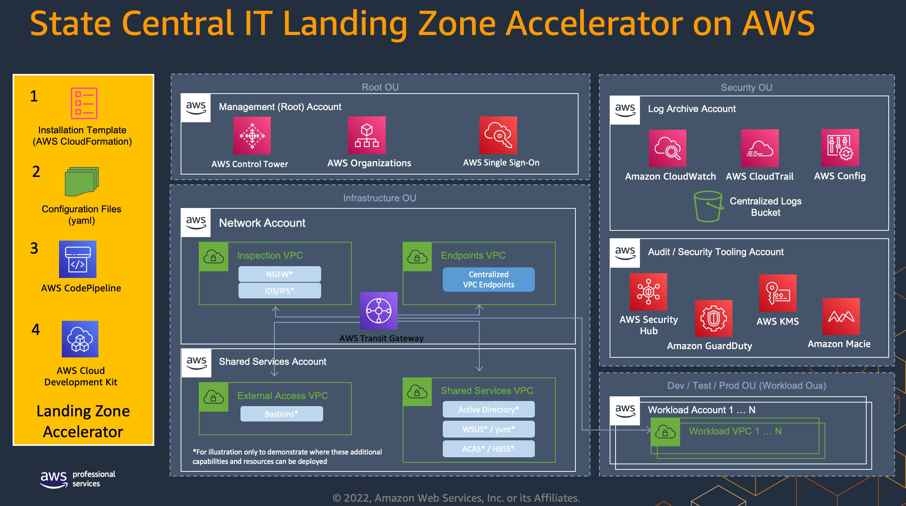
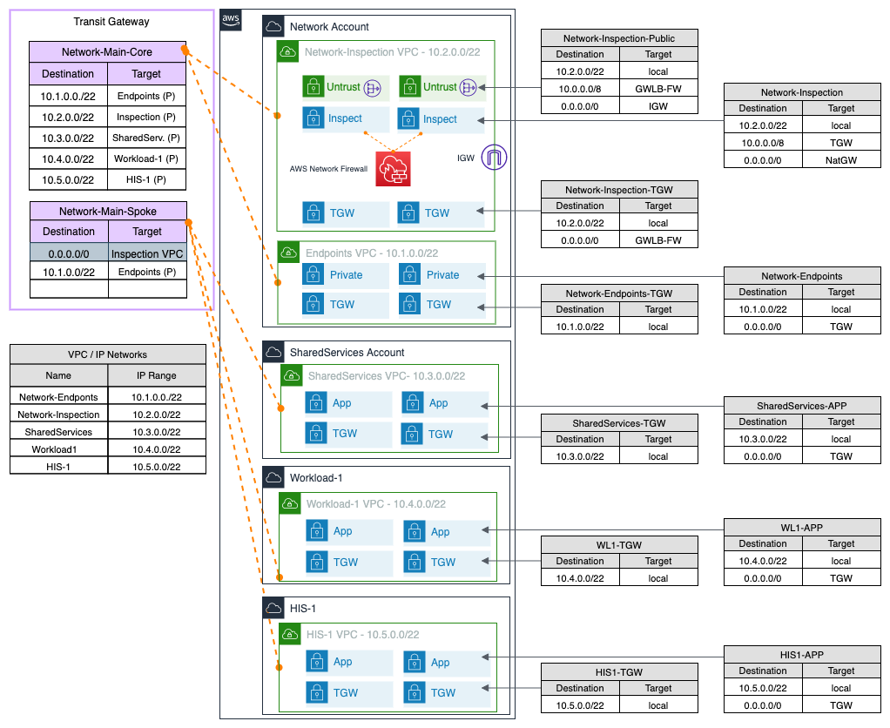

# Landing Zone Accelerator on AWS for State and Local Government Central IT 

## Overview

The Landing Zone Accelerator (LZA) for State and Local Government Central IT is an industry specific deployment of the [Landing Zone Accelerator on AWS](https://aws.amazon.com/solutions/implementations/landing-zone-accelerator-on-aws/) solution architected to align with AWS best practices and in conformance with multiple, global compliance frameworks. Built on top of the standard AWS Control Tower accounts, namely `Management`, `Audit`, and `LogArchive`, the LZA for State and Local Government Central IT deploys additional resources that helps establish platform readiness with security, compliance, and operational capabilities.   It is important to note that the Landing Zone Accelerator solution will not, by itself, make you compliant. It provides the foundational infrastructure from which additional complementary solutions can be integrated. You must review, evaluate, assess, and approve the solution in compliance with your organization’s particular security features, tools, and configurations.


State and Local Government Central IT organizations often provide varying level of service, guidance, and oversight to the range of state agencies within the state. These agencies may differ in level of IT sophistication, services and solutions within their agency depending on their mission. As a result, some agencies work with a higher level of autonomy while others leverage more support from State and Local Government Central IT.  The following bullets highlight typical components observed as part of State and Local Government Central IT.

State and Local Government Central IT often operates as a shared services organization that provides services in 3 primary areas.
* Centralized networking to facilitate some or all agency and department interaction as well as centralized Internet onramp.  This function often includes firewall and inspection disciplines.
* Centralized shared services including Directory Services, Identity Federation, Email, and other services ranging from DNS, vulnerability scanning, and OS patching to name a few.
* Security and Governance function to facilitate and help align the overall security posture of State and Local Government Central IT and to the state agencies they serve.

The Landing Zone Accelerator on AWS enables State and Local Government Central IT to offer agencies a secure and agile foundation for their AWS Cloud workloads. 

## Deployment Overview

Use the following steps to deploy the industry guidance. For detailed instructions, follow the links for each step.

[Step 1. Launch the stack](https://docs.aws.amazon.com/solutions/latest/landing-zone-accelerator-on-aws/step-1.-launch-the-stack.html)

* Launch the AWS CloudFormation template into your AWS account.
* Review the templates parameters and enter or adjust the default values as needed.

[Step 2. Await initial environment deployment](https://docs.aws.amazon.com/solutions/latest/landing-zone-accelerator-on-aws/step-2.-await-initial-environment-deployment.html)

* Await successful completion of `AWSAccelerator-Pipeline` pipeline.

Step 3. Copy the configuration files

* Clone the `aws-accelerator-config` AWS CodeCommit repository.
* Clone the [landing-zone-accelerator-on-aws](https://github.com/awslabs/landing-zone-accelerator-on-aws) repo
* Copy the configs and all the contents from the `aws-best-practices` folder under `reference/sample-configurations` to your local `aws-accelerator-config` repo.
* Copy the contents from the `aws-best-practices-us-slg-central-it` folder under `reference/sample-configurations` to your local `aws-accelerator-config` repo.  You may be prompted to over-write duplicate configs, such as `accounts-config.yaml`.

Step 4. Update the configuration files and release a change.

* Using the IDE of your choice.  Update the `homeRegion` variable at the top of each config to match the region you deployed the solution to.
* Update the configuration files to match the desired state of your environment. Look for the `UPDATE` comments for areas requiring updates, such as e-mail addresses in your `accounts-config.yaml`
* Review the contents in the `Security Controls` section below to understand if any changes need to be made to meet organizational requirements, such as applying SCPs to the various OUs.
* Commit and push all your change to the `aws-accelerator-config` AWS CodeCommit repository.
* Release a change manually to the AWSAccelerator-Pipeline pipeline.

## Components of this Industry Best Practice Configuration

This section describes components of the LZA configuration that are included and items that are not included.

### What is included in this industry configuration
* An AWS multi-account organization structure with standard OUs and Accounts aligned toward separation of duties while allowing agility of business unit and/or mission workloads.
* A bias toward security governance via AWS security tooling and an emphasis on security controls aligned with the NIST 800-53 rev 5 security framework. Many regulations and certifications such as HIPAA, FedRAMP, and IRS Publication 1075 leverage NIST 800-53 rev5 security framework as foundational.
* There are optional configurations intended to help organizations with workloads aligned with HIPAA regulations.
* Future configuration options that include additional security controls that align with IRS Publication 1075 and FedRAMP.
* Network configurations for purposes related to central inspection and egress, AWS PrivateLink Endpoints, and a SharedService network to centralize shared workloads. The network patterns also align with common role segmentation.
* AWS Security Service configurations like: 
AWS Security Hub provides a comprehensive view of your security state in AWS, including multiple best practice standards. This configuration enables the AWS Foundational Best Practice and AWS CIS Benchmark Best Practice security standards. Other security related tooling and configurations are implemented including Amazon Macie, AWS GuardDuty, and encryption of block storage by default.
    
### What is NOT included in this industry Configuration
This section offers examples of some LZA capabilities that are not reflected in this best practice configuration as they are more unique to customer circumstances.
* LZA offers support for Hybrid DNS configurations using the Route 53 Resolver Endpoints are not configured here, but can and should be added as needed for your implementation.
* LZA offers integration with Amazon VPC IP Address Manager (IPAM) but is not implemented within this State and Local Government Central IT configuration.
* Please also reference the [for further consideration](#for-further-consideration) section below as you begin to experiment with the LZA for State and Local Government Central IT.

### What differs from general LZA Best Practice Configuration
This section offers examples of recomended configuration variances from standard LZA configurations. In all cases, the user is encouraged to review these configurations and maintains flexibility to enable or disable configurations as needed to meet their own business and compliance goals.

* Security
  * Enables Security Hub AWS Foundational Best Practices and Security Hub CIS AWS Foundation Benchmark standards. The Security Hub PCI DSS can be optionally enabled but the security controls are covered by the 2 standards implemented.
  * LZA allows for enabling a granular set of security controls. Because NIST 800-53 rev5 framework is foundational for State Governments adhering to healthcare and IRS regulations as well as other certifications such as FedRAMP, a set of 15 incremental config rules were added to the security-config.yaml that align with the [Operational Best Practices for NIST 800-53 rev 5 Conformance Pack].  The remainder of the conformance pack is covered by Security Hub Best Practice Standards and other LZA Configurations. Being foundational, these rules are applied at the Root OU and inherited throughout the environment.
  * 6 incremental Config Rules were added for backup validation that align with the [Operational Best Practices for HIPAA Security Conformance Pack]. These rules are optional and recomended to be applied at the `Tenant-HIS` OU as they are aligned with HIPAA. 
  * Enabled automated configuration to update EC2-Default-SSM-AD IAM Role with LZA created IAM policies to leverage AWS SSM Session Manager encrypted sessions and centralized logging.
* Organization
  * Recomend to enable the best practice `Guardrails1` and `Guardrails2` Service Control Policies at the Root OU and not the Infrastructure OU.
  * Added `Guardrails3` to prevent the removal of S3 Block Public Access and prevent an account from leaving the organization. Recomend to enable at the Root OU.
  * Using `HIPAA` Service Control Policy to allow HIPAA eligible services within the `Tenant-HIS` OU.
* Network
  * Transit Gateway configured with only 2 route tables - core and spoke.
  * Utilizes core and spoke design with central inspection.
  * The central inspection VPC has public egress subnets and an Internet Gateway.
  * The central insepction VPC samples STATEFUL inspection rules and domain list denial.
  * A centralized DNS Firewall is implemented with example block and override rules. The DNS Firewall is shared throughout and all 4 sample VPCs opt-in.
  * Route53 DNS Query Logs are implemented in all sample VPCs.

## Security Frameworks and AWS Business Associate Addendum (BAA)
State and Local Governments are highly regulated. The LZA for State and Local Government Central IT provides additional guardrails to help mitigate against the threats faced by these organizations. The LZA for State and Local Government Central IT is not meant to be feature complete or fully compliant, but rather is intended to help accelerate cloud migrations and cloud refactoring efforts by entities serving US State IT Organizations.  While much effort has been made to reduce the effort required to manually build a production-ready infrastructure, you will still need to tailor it to your unique business needs.

Because of the variation in IT workloads and missions across state agencies, State and Local Government Central IT must be aware of numerous frameworks including IRS Publication 1075, FedRAMP, and HIPAA. The bulk of these frameworks lean on NIST 800-53 rev 5 as a foundation for their compliance standards. As a result, the State and Local Government Central IT best practice configurations uses AWS controls from NIST Cybersecurity Framework as starting point and offers additional or optional control configurations aligned with HIPAA. At this time, additional configurations are not implemented for IRS Publication 1075 but are planned.

Lastly, if the organization does intend to leverage PHI or HIPAA based workloads, the user should log into the Management account, navigate to AWS Artifact, select Agreements.  Within the "Organizational agreements" pane, select the "AWS Organizations Business Associate Addendum" and select "Accept agreement" to activate the BAA relationship between yourselves and AWS.  This should be completed before moving PII/HIPAA workloads into the Landing Zone.

## Security Controls
These controls are created as detective or preventative guardrails in the AWS environment through AWS Config rules or through Service Control Policies (SCPs). Within the file `organization-config.yaml` are sections for declaring SCPs, Tagging Policies, and Backup Policies. SCPs can be highly specific to the organization and its workload(s) and should be reviewed and modified to meet your specific requirements.  Sample policies have been provided for the following:  
* `Service Control Policies`:  A number of Service Control Policies are included with this configuration.
  * `service-control-policies/guardrails-1.json`: Assigned to Root OU to protect LZA constructs including Config Rules, Lambdas, SNS, and EBS Encryption. 
  * `service-control-policies/guardrails-2.json`: Assigned to Root OU to protect LZA constructs including IAM Policies, IAM Roles, Security Hub, GuardDuty, Macie, CloudFormation Stacks and SSM. 
  * `service-control-policies/guardrails-3.json`: Assigned at Root OU and prevents accounts from leaving your organization or disabling block public access for Amazon S3.  
  * `service-control-policies/scp-hlc-hipaa-service.json`: Recomended to be assigned at the `Tenant-HIS` OU as an example of a policy that can be used to ensure only HIPAA eligible services can be used in a specific OU or account. It is important to note that SCPs are not automatically updated and that changes to the HIPAA eligible service list will be to be updated.  However, this is an example of how your organization can ensure that a select list of AWS services are used for specific use cases.
* `Tagging Policies`: A sample tagging policy has been provided.
  * `tagging-policies/healthcare-org-tag-policy.json:` Includes polices for sample tagging strategies with a starter taxanomoy.
    * `CostCenter` with sample values of `100` and `200`.
    * `EnvironmentType` for `Prod`, `QA`, and `Dev` workloads.
    * `DataClassification` to track sensitive and non-sensitive workloads such as `PHI`, `PII`, and `CompanyConfidential`.
    * The included policy includes sample enforcement for specific AWS services. The sample policy should be edited to reflect your own organization's respective values so that resources provisioned by the LZA are tagged in accordance with your business requirements.
* `Backup policies`: A sample backup policy has been provided.
  * `backup-policies/backup-plan.json` as an example for how backups can be scheduled and accompanied by lifecycle and retention management settings.

In the `security-config.yaml` file, AWS security services can be configured such as AWS Config, AWS Security Hub, and enabling storage encryption. Additional alarms and metrics have been provided to inform you of actions within your AWS Cloud environment. For a list of all of the services and settings that can be configured, see the [LZA on AWS Implementation Guide](#references) in the references section below. This file also contains the AWS Config rules that make up the list of detective guardrails used to meet many of the controls from various frameworks. These rules are implemented through a combination from Security Hub AWS Foundational Security Best Practices, CIS AWS Foundations Benchmark, and the rules from the following:
* [Operational Best Practices for NIST 800-53 rev 5 Conformance Pack](https://docs.aws.amazon.com/config/latest/developerguide/operational-best-practices-for-nist-800-53_rev_5.html)
* [Operational Best Practices for HIPAA Security Conformance Pack](https://docs.aws.amazon.com/config/latest/developerguide/operational-best-practices-for-hipaa_security.html).  

The `global-config.yaml` file contains the settings that enable regions, centralized logging using AWS CloudTrail and Amazon CloudWatch Logs and the retention period for those logs to help you meet your specific auditing and monitoring needs.

You are encouraged to review these settings to better understand what has already been configured and what needs to be altered for your specific requirements.

## Organizational Structure

State and Local Government Central IT LZA accounts are generated and organized as follows:
<!--
```sh
+-- Root
|   +-- Management
|   +-- Security
|       +-- LogArchive
|       +-- Audit
|   +-- Infrastructure
|       +-- Network
|       +-- SharedServices
|   +-- Tenant
|       +-- Workload-1
|       +-- Workload-2
|   +-- Tenant-HIS
|       +-- HIS-1
|       +-- HIS-2
```
-->
 

The State and Local Government Central IT OU structure is comprised of centralized management OUs - i.e. `Root`, `Security`, and `Infrastructure` and application or workload OUs - i.e. `Tenant` and `Tenant-HIS`.

The Security and Infrastructure OUs are intended for overall landing zone governance and shared services management.  These OUs have security controls aligned with the AWS Security Hub AWS Foundational Best Practices, AWS Security Hub CIS AWS Foundations Benchmark, and controls found within the Conformance Pack [Operational Best Practices for NIST 800-53 rev 5](https://docs.aws.amazon.com/config/latest/developerguide/).

The Tenant Organizational Unit (OU) represents the logical construct for general workloads and would have security controls aligned within the Conformance Pack [Operational Best Practices for NIST 800-53 rev 5](https://docs.aws.amazon.com/config/latest/developerguide/).

The Health Information System Tenant Organizational Unit (OU) represents the logical construct where workloads that contain sensitive data, such as critical business or Personal Health Information (PHI). It would inherit all of the security controls previously mentioned and incremental controls found within [Operational Best Practices for HIPAA Security](https://docs.aws.amazon.com/config/latest/developerguide/operational-best-practices-for-hipaa_security.html).  This OU also has the Service Control Policy `scp-hlc-hipaa-service` which limits usable services to those that are allowable under the BAA.

This OU structure is provided for you. However, you are free to change the organizational structure, Organizational Units (OUs), and accounts to meet your specific needs. For additional information about how to best organize your AWS OU and account structure, please reference the Recommended OUs and accounts in the [For further consideration](#for-further-consideration) section below as you begin to experiment with the LZA for State and Local Government Central IT.


## Architecture Diagrams
AWS LZA for State and Local Government Central IT Organizational Structure


By default, the LZA for State and Local Government Central IT builds the above organizational structure, with the exception of the `Management` and `Security` OUs, which are predefined by you prior to launching the LZA.  The below architecture diagram highlights the key deployments:

* An `Infrastructure` OU
  * Contains one `Network` and one `SharedServices` Account.
  * The `Network` account contains a Transit Gateway for infrastructure routing
  * The `Network` account contains 2 VPCs - Network-Inspection and Network-Endpoints, both are in `us-east-1`.
  * The `SharedServices` account contains 1 VPC for workloads in `us-east-1`.
  * Each VPC uses a /22 CIDR block in the 10.0.0.0/8 RFC-1918 range
* A `Tenant` OU
  * Contains one `Workload-1` and one `Workload-2` Account
  * A sample VPC for `Workload-1` account in `us-east-1` is included with this configuration.
  * Each VPC uses a /22 CIDR block in the 10.0.0.0/8 RFC-1918 range
* A `Tenant-HIS` OU
  * Contains one `HIS-1` and one `HIS-2` Account
  * A sample VPC for `HIS-1` account in `us-east-1` is included with this configuration.
  * Each VPC uses a /22 CIDR block in the 10.0.0.0/8 RFC-1918 range


AWS LZA for State and Local Government Central IT Network Diagram 


* The accounts in the `Tenant` OU represent a standard infrastructure for development or production deployment of your standard or non-HIPAA related workloads.
* The accounts in the `Tenant-HIS` OU represent a standard infrastructure for development or production deployment of your PHI or HIPAA related workloads.
* The `Infrastructure` OU provides the following specialized functions:
  * The `Network` account contains a `Network Inspection VPC` for inspecting AWS traffic as well as routing traffic to and from the Internet.  If a route table is defined, for example `Network-Main-Core`, traffic will flow from the `HIS-1 VPC` through the `Network-Main-TGW` Transit Gateway, where it will can be inspected by AWS Firewall before being dropped, passed to another VPC (i.e. `Workload-1 VPC`) or continuing to the internet.
  * The `SharedServices` VPC is intended to house centrally-shared services that are accessible to all of the accounts in your infrastructure. For example, you might deploy central security services such as Endpoint Detection and Response (EDR) or a central directory service such as LDAP. This central location and corresponding route tables allow you to efficiently design your network and compartmentalize access control accordingly.
## Cost
You are responsible for the cost of the AWS services used while running this solution. As of November 2022, the cost for running this solution using the Landing Zone Accelerator with the State and Local Government Central IT configuration files and AWS Control Tower in the US East (N. Virginia) Region within a test environment with no active workloads is between $1000-$1,1250 USD per month.  As additional AWS services and workloads are deployed, the cost will increase.  It is also noteworthy VPC inspection is approximately 60% of the cost of this configuration.  While this is a significant percentage, the ability to inspect and control network traffic in  environment is an important capability for improving your overall security posture.

| AWS Service      | Cost per month |
| ---------------- | ----------- |
| AWS CloudTrail  | $9.33 |
| Amazon CloudWatch | $0.93 |
| Amazon Config | $22.20 |
| Amazon GuardDuty | $8.10 |
| Amazon Macie (30 buckets, access controls only) | $3.00 |
| AWS Key Management Services (AWS KMS) | $45.90 |
| Amazon Route 53 | $4.16 |
| Amazon Simple Storage Service (Amazon S3) | $3.09 |
| Amazon Virtual Private Cloud (Amazon VPC) | $276.54 |
| AWS Network Firewall | $573.60 |
| AWS Security Hub | $2.80 |
| AWS Secrets Manager | $0.00 |
| Amazon Simple Notification Service (Amazon SNS) | $0.42 |
| Total monthly cost | $962.73 |


## For further consideration

Although the State and Local Government Central IT configuration aims to be prescriptive in applying best practices for State and Local Government Centralized IT customers, it intentionally avoids being *overly prescriptive* out of deference to the unique realities for each individual organization. Consider the baseline State and Local Government Central IT configuration as a good starting point, but bear in mind your objectives as you begin to tailor it for your specific business requirements. From this perspective AWS provides resources that you should consult as you begin customizing your deployment of the State and Local Government Central IT LZA:

1. This set of configuration files was tested with AWS Control Tower version 3.0.  AWS Control Tower 3.0 supports the use of an AWS CloudTrail Organization Trail.  The global-config.yaml file shows organizationTrail set to false because it is assumed enabled through the AWS Control Tower setup.
1. Refer to the [Best Practices] for Organizational Units with AWS Organizations blog post for an overview.
1. [Recommended OUs and accounts].  This section of the `Organizing your AWS Environment Using Multiple Accounts` Whitepaper discusses the deployment of specific-purpose OUs in addition to the foundational ones established by the LZA.  For example, you may wish to establish a `Sandbox` OU for experimentation, a `Policy Staging` OU to safely test policy changes before deploying them more broadly, or a `Suspended` OU to hold, constrain, and eventually retire accounts that you no longer need.
1. [AWS Security Reference Architecture] (SRA). The SRA "is a holistic set of guidelines for deploying the full complement of AWS security services in a multi-account environment."  This document is aimed at helping you to explore the "big picture" of AWS security and security-related services in order to determine the architectures most suited to your organization's unique security requirements.
1. Transit Gateway Flow logs are not enabled by default, work with your AWS team to determine if enabling TGW Flow logs help you meet your regulatory and organizational requirements.  


## References

* LZA on AWS [Implementation Guide].  This is the official documentation of the Landing Zone Accelerator Project and serves as your starting point.
* AWS Labs [LZA Accelerator] GitHub Repository.  The official codebase of the Landing Zone Accelerator Project.
* AWS compliance details focused on [NIST Compliance].
* AWS compliance details focused on [HIPAA Compliance].
* AWS HIPAA eligible services site: [HIPAA Eligible Services Reference]

<!-- Hyperlinks -->
[Best Practices]: https://aws.amazon.com/blogs/mt/best-practices-for-organizational-units-with-aws-organizations/
[Recommended OUs and accounts]: https://docs.aws.amazon.com/whitepapers/latest/organizing-your-aws-environment/recommended-ous-and-accounts.html
[AWS Security Reference Architecture]: https://docs.aws.amazon.com/prescriptive-guidance/latest/security-reference-architecture/welcome.html
[Implementation Guide]: https://docs.aws.amazon.com/solutions/latest/landing-zone-accelerator-on-aws/landing-zone-accelerator-on-aws.pdf
[Operational Best Practices for NIST 800-53 rev 5 Conformance Pack]: https://docs.aws.amazon.com/config/latest/developerguide/operational-best-practices-for-nist-800-53_rev_5.html
[Operational Best Practices for HIPAA Security Conformance Pack]: https://docs.aws.amazon.com/config/latest/developerguide/operational-best-practices-for-hipaa_security.html
[Operational Best Practices for HIPAA Security]: https://docs.aws.amazon.com/config/latest/developerguide/operational-best-practices-for-hipaa_security.html
[LZA Accelerator]: https://github.com/awslabs/landing-zone-accelerator-on-aws
[VPC Sharing: key considerations and best practices]: https://aws.amazon.com/blogs/networking-and-content-delivery/vpc-sharing-key-considerations-and-best-practices/
[NIST Compliance]: https://aws.amazon.com/compliance/nist/
[HIPAA Compliance]: https://aws.amazon.com/compliance/hipaa-compliance/
[HIPAA Eligible Services Reference]: https://aws.amazon.com/compliance/hipaa-eligible-services-reference/
[AWS FedRAMP Compliance]: https://aws.amazon.com/compliance/fedramp/
