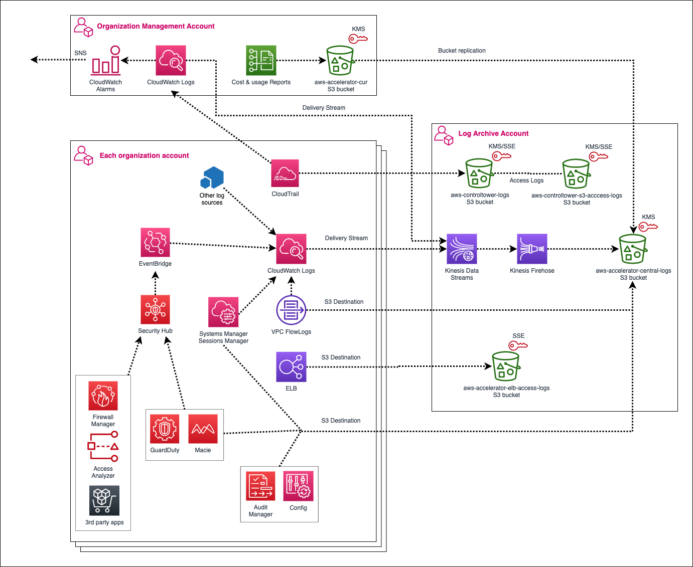
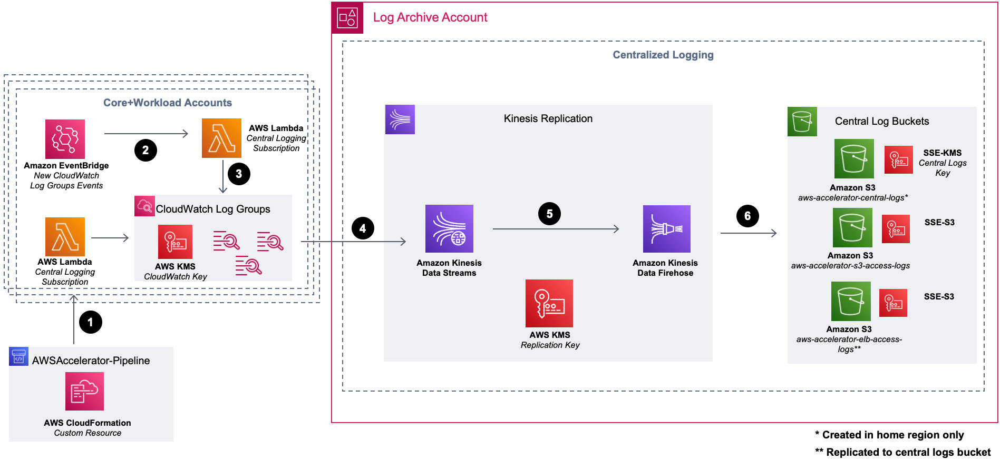

# Standard Configuration

# 1. Table of Contents

[1. Table of Contents](#1-table-of-contents)  
[2. Overview](#2-overview)  
[3. Organization and Account Structure](#3-organization-and-account-structure)  
[4. Authorization and Authentication](#4-authorization-and-authentication)  
[5. Logging and Monitoring](#5-logging-and-monitoring)  
[6. Networking](#6-networking)

# 2. Overview

The [Landing Zone Accelerator on AWS (LZA)](https://aws.amazon.com/solutions/implementations/landing-zone-accelerator-on-aws/) is architected to align with AWS best practices and in conformance with multiple, global compliance frameworks. We recommend customers deploy [AWS Control Tower](https://aws.amazon.com/controltower) as the foundational landing zone and enhance their landing zone capabilities with Landing Zone Accelerator. These complementary capabilities provides a comprehensive low-code solution across 35+ AWS services to manage and govern a multi-account environment built to support customers with highly-regulated workloads and complex compliance requirements. AWS Control Tower and Landing Zone Accelerator help you establish platform readiness with security, compliance, and operational capabilities.

The configuration of LZA is managed through _configuration files_. Configuration files are written in [YAML](https://yaml.org/) and define the AWS account and service configurations that meet specific compliance objectives. Using the configuration files, the solution helps users manage the lifecycle of their landing zone by setting up a baseline security architecture and automating common administrative and operational activities. This reduces the undifferentiated heavy lifting associated with building regulated environments on AWS, allowing organizations to focus on other high value concerns such as operating models, developer agility, and reducing costs.

After deploying LZA and implementing these configuration files, you can:

- Configure additional functionality, guardrails, and security services such as [AWS Config](http://aws.amazon.com/config/) Managed Rules and [AWS Security Hub](http://aws.amazon.com/security-hub/)
- Manage your foundational networking topology such as [Amazon Virtual Private Cloud](http://aws.amazon.com/vpc/) (Amazon VPC), [AWS Transit Gateway](http://aws.amazon.com/transit-gateway/), and [AWS Network Firewall](http://aws.amazon.com/network-firewall/)
- Generate additional workload accounts using the [AWS Control Tower Account Factory](https://docs.aws.amazon.com/controltower/latest/userguide/account-factory.html) or [AWS Organizations](https://docs.aws.amazon.com/organizations/latest/userguide/orgs_introduction.html)

This guide describes architectural considerations, design, and configuration steps for deploying the LZA sample configuration files.

We recommend you familiarize yourself with the [best practices for for managing your configuration files](https://docs.aws.amazon.com/solutions/latest/landing-zone-accelerator-on-aws/configuration-file-best-practices.html) before making any chances to your environment.

**Note:** This README is focused on the [general sample configuration](/reference/sample-configurations/lza-sample-config), not the industry specific configuration files which can be found [here](/reference/sample-configurations).

## 2.1. Design Principles

1. Help customers implement a secure by design multi-account architecture aligned to AWS best practices
2. Maximize agility, scalability, and availability while minimizing cost
3. Enable the full capabilities of the AWS cloud
4. Remove burden from customers by maintaining the deployment engine and configuration files to make use of the latest AWS innovations
5. Offer customers flexibility to add capabilities and reconfigure the environment in an automated manner
6. Reduce scope of impact by implementing logical separation between functions e.g. organizational networking, security, and workloads

## 2.2. Architecture Summary

The architecture and best practices defined in these configuration files are heavily influenced by the AWS whitepaper [Organizing Your AWS Environment Using Multiple Accounts](https://docs.aws.amazon.com/whitepapers/latest/organizing-your-aws-environment/organizing-your-aws-environment.html) and the [AWS Security Reference Architecture](https://docs.aws.amazon.com/prescriptive-guidance/latest/security-reference-architecture/welcome.html). We highly recommend you read this guidance to understand the detail behind the architecture and its application in context of your organization's unique objectives.

## 2.4. Document Conventions

The following conventions are used throughout this document.

#### 2.4.0.1. AWS Account Numbers

AWS account numbers are decimal-digit pseudorandom identifiers with 12 digits (e.g. `111122223333`). This document will use the convention that an AWS Organization Management (root) account has the account ID `123456789012`, and child accounts are represented by `111122223333`, `444455556666`, etc.
For example the following ARN would refer to a VPC subnet in the `us-east-1` region in the Organization Management (root) account:

```
arn:aws:ec2:us-east-1:123456789012:subnet/subnet-0e9801d129EXAMPLE
```

#### 2.4.0.2. JSON Annotation

Throughout the document, JSON snippets may be annotated with comments (starting with `//`). The JSON language itself does not define comments as part of the specification; these must be removed prior to use in most situations, including the AWS Console and APIs.
For example:

```
{
    "Effect": "Allow",
    "Principal": {
    "AWS": "arn:aws:iam::123456789012:root" // Trust the Organization Management account
    },
    "Action": "sts:AssumeRole"
}
```

The above is not valid JSON without first removing the comment on the fourth line.

#### 2.4.0.3. IP Addresses

The sample [network configuration file](network-config.yaml) may make use of [RFC1918](https://tools.ietf.org/html/rfc1918) addresses (e.g. `10.1.0.0/16`) and [RFC6598](https://tools.ietf.org/html/rfc6598) (e.g. `100.96.250.0/23`) for various networks; these will be labeled accordingly. Any specific range or IP shown is purely for illustration purposes only.

#### 2.4.0.4. Customer Naming

This document will make no reference to specific AWS customers. Where naming is required (e.g. in domain names), this document will use a placeholder name as needed; e.g. `example.com`.

# 3. Organization and Account Structure

## 3.1. Overview

_Landing Zone Accelerator_ uses AWS Accounts to enforce strong isolation between teams, business units and application functions. The sections below discuss the account design, the sample configuration files create through, [AWS Control Tower](https://aws.amazon.com/controltower/) or [AWS Organizations](https://docs.aws.amazon.com/organizations/latest/userguide/orgs_introduction.html).

## 3.2. Organization structure

The _Landing Zone Accelerator_ includes the following default AWS organization and account structure.

**Note:** the AWS account structure is strictly a control plane concept - nothing about this structure implies anything about the network architecture or network flows.


### 3.2.1. Organization Management (root) AWS Account

The AWS Organization resides in the [Organization Management (root) AWS account](https://docs.aws.amazon.com/prescriptive-guidance/latest/security-reference-architecture/org-management.html) and is traditionally an organization's first AWS account. This account is not used for workloads - it functions primarily as a billing aggregator, and a gateway to the entire cloud footprint for high-trust principals. Additionally, the Organization Management account is where the automation engine or tooling is installed to automate the deployment of the LZA architecture and its security guardrails. As per the best practices resources described above, access to this account must be carefully governed.

## 3.3. Organizational Units

Underneath the root of the organization, [Organizational Units (OU)](https://docs.aws.amazon.com/organizations/latest/userguide/orgs_getting-started_concepts.html) (OUs) provide a mechanism for grouping accounts into logical collections. LZA makes use of OUs to enforce specific preventative controls through [service control policies (SCPs)](https://docs.aws.amazon.com/organizations/latest/userguide/orgs_getting-started_concepts.html), resource sharing across the organization through [Resource Access Manager](https://aws.amazon.com/ram/), and the ability to apply LZA configurations to groups of accounts e.g. a specific network pattern deployment.

The Default sample configuration files OU structure is shown below:


For further details to help you plan your OU structure beyond the defaults provided by these configuration files, review the [best practices for organizational units](https://docs.aws.amazon.com/whitepapers/latest/organizing-your-aws-environment/benefits-of-using-ous.html) and also the [recommendations on OUs and accounts](https://docs.aws.amazon.com/whitepapers/latest/organizing-your-aws-environment/recommended-ous-and-accounts.html).

### 3.3.1. Security OU

The [accounts in this OU](https://docs.aws.amazon.com/whitepapers/latest/organizing-your-aws-environment/security-ou-and-accounts.html) are considered administrative in nature with access often restricted to IT security personnel. The sample configuration files add two accounts to this OU:

- [Security Tooling account](https://docs.aws.amazon.com/prescriptive-guidance/latest/security-reference-architecture/security-tooling.html)
- [Log Archive account](https://docs.aws.amazon.com/prescriptive-guidance/latest/security-reference-architecture/log-archive.html)

### 3.3.2. Infrastructure OU

The [accounts in this OU](https://docs.aws.amazon.com/whitepapers/latest/organizing-your-aws-environment/infrastructure-ou-and-accounts.html) are also considered administrative in nature with access often restricted to IT operations personnel. The sample configuration files add two accounts to this OU:

- [Network account](https://docs.aws.amazon.com/prescriptive-guidance/latest/security-reference-architecture/network.html)
- [Shared Services account](https://docs.aws.amazon.com/prescriptive-guidance/latest/security-reference-architecture/shared-services.html)

## 3.4. Core Accounts

Core accounts can be defined as accounts that have special significance within the organization. Often these will provide functions shared across accounts within the organization, for example, centralized logging or network services.

The Landing Zone Accelerator deployment enforces a subset of core accounts as defined in the [mandatory accounts section of the implementation guide](https://docs.aws.amazon.com/solutions/latest/landing-zone-accelerator-on-aws/mandatory-accounts.html). The sample configuration adds additional core accounts for the specific functions listed below.


- [Management account](https://docs.aws.amazon.com/prescriptive-guidance/latest/security-reference-architecture/org-management.html)
- [Audit account (Security Tooling)](https://docs.aws.amazon.com/prescriptive-guidance/latest/security-reference-architecture/security-tooling.html)
- [Log Archive account](https://docs.aws.amazon.com/prescriptive-guidance/latest/security-reference-architecture/log-archive.html)
- [Network account (Transit)](https://docs.aws.amazon.com/prescriptive-guidance/latest/security-reference-architecture/network.html)
- [Shared Services account](https://docs.aws.amazon.com/prescriptive-guidance/latest/security-reference-architecture/shared-services.html)

## 3.5. Workload Accounts

[Workload (Application) accounts](https://docs.aws.amazon.com/prescriptive-guidance/latest/security-reference-architecture/application.html) are created on demand and placed into an appropriate OU in the organization structure. The purpose of workload accounts is to provide a secure and managed environment where project teams can use AWS resources. They provide an isolated control plane so that the actions of one team in one account cannot inadvertently affect the work of teams in other accounts.

## 3.6. Account Level Security Settings

The LZA sample configuration files enable certain account-wide features on account creation. Namely, these include:

1. [S3 Public Access Block](https://docs.aws.amazon.com/AmazonS3/latest/dev/access-control-block-public-access.html#access-control-block-public-access-options)
2. [Default encryption of EBS volumes](https://docs.aws.amazon.com/AWSEC2/latest/UserGuide/EBSEncryption.html#encryption-by-default) using a customer managed local account KMS key
3. [Tagging policy](./tagging-policies/org-tag-policy.json) applied to the root OU via the [organization-config.yaml **taggingPolicies** key](./organization-config.yaml). To help you define a tagging policy that meets your organizations see [AWS tagging best practices](https://docs.aws.amazon.com/organizations/latest/userguide/orgs_manage_policies_tag-policies-best-practices.html). You can then amend the example tagging policy provided by these configuration files.
4. [Backup Policy](./backup-policies/backup-plan.json) applied to the root OU via the [organization-config.yaml **backupPolicies** key](./organization-config.yaml).

# 4. Authorization and Authentication

## 4.1. Overview

The Landing Zone Accelerator makes extensive use of AWS authorization and authentication primitives from the Identity and Access Management (IAM) service as a means to enforce the guardrail objectives of the Landing Zone Accelerator and govern access to the set of accounts that makes up the organization.

## 4.2. Relationship to the Management (root) AWS Account

By default, AWS accounts are entirely self-contained with respect to IAM principals - their Users, Roles, Groups are independent and scoped only to themselves. Accounts created by AWS Organizations deploy a default role with a trust policy back to the Organization Management account. While it can be customized, by default this role is named the `AWSControlTowerExecution` (or `OrganizationAccountAccessRole` when AWS Organizations is used without Control Tower).

### 4.3. AWS IAM Identity Center (successor to AWS Single Sign-On)

The vast majority of end-users of the AWS cloud within the organization will never use or interact with the Management account or the root users of any child account in the organization.

[AWS IAM Identity Center](https://aws.amazon.com/iam/identity-center/) (AWS IIC) resides in the Organization Management account. Once deployed from the Organization Management account, it is recommended that AWS IIC administration is [delegated to the Shared Services account](https://docs.aws.amazon.com/prescriptive-guidance/latest/security-reference-architecture/dedicated-accounts.html). AWS IIC lets you create user, group, and role-based identities directly using a default local identity provider (IdP). Alternatively, if your organization has an existing IdP such as Microsoft Active Directory or Okta Universal Directory, it is recommended to [set up federation](https://docs.aws.amazon.com/whitepapers/latest/establishing-your-cloud-foundation-on-aws/federated-access.html) with that identity provider. This allows you take advantage of your existing identity and access management processes for identities accessing your AWS environment.

## 4.4. Break Glass Accounts

The Management account is used to provide [break glass access](https://docs.aws.amazon.com/whitepapers/latest/organizing-your-aws-environment/break-glass-access.html) to AWS accounts within the organization. The details of the break glass usernames can be found within [iam-config.yaml](./iam-config.yaml). The password details can be found in the Management account AWS Secrets Manager in the region LZA was deployed to. After the deployment of the sample configuration files is complete, multi-factor authentication (MFA) should be enabled on these accounts (please see the next section for more details).

## 4.5. Multi-Factor Authentication (MFA)

MFA should be used by all users regardless of privilege level with some [general guidelines](https://docs.aws.amazon.com/prescriptive-guidance/latest/aws-startup-security-baseline/acct-05.html). A number of commonly popular MFA mechanisms [are supported by AWS](https://docs.aws.amazon.com/IAM/latest/UserGuide/id_credentials_mfa.html) to help customers enable MFA on their accounts.

## 4.6. Root Authorization

Every AWS account has a set of root user credentials. These root credentials are generated on account creation with a random 64-character password. It is important that the root credentials for each account are recovered and MFA enabled using the AWS root credential password reset process for the account’s unique email address.

Root credentials authorize all actions for all AWS services and for all resources in the account (except anything denied by service control policies (SCPs)). There are some actions which only root has the capability to perform which are documented within the [AWS documentation](https://docs.aws.amazon.com/general/latest/gr/aws_tasks-that-require-root.html). These are typically rare operations (e.g. creation of X.509 keys), and should not be required in the normal course of business. Root credentials should be handled with extreme diligence and have MFA enabled per the guidance in the previous section.

## 4.8. Service Control Policies (SCPs)

Service Control Policies are a key preventative control used by the LZA. It is crucial to note that SCPs, by themselves, never _grant_ permissions. They are most often used to `Deny` certain actions at an OU or account level within an AWS Organization. Since `Deny` always overrides `Allow` in the IAM policy evaluation logic, SCPs can have a powerful effect on all principals in any account, and can deny entire categories of actions irrespective of the permission policy attached to the principal itself - even the root user of the account.

SCPs follow an inheritance pattern from all levels of the hierarchy down to the account of the organization:


In order for any principal to be able to perform an action A, it is necessary (but not sufficient) that there is an `Allow` on action A from all levels of the hierarchy down to the account, and no explicit `Deny` anywhere. This is discussed in further detail in [How SCPs Work](https://docs.aws.amazon.com/organizations/latest/userguide/orgs_manage_policies_scps-about.html).

The LZA leverages the following SCPs in the organization:

### 4.8.1 Guardrails 1 and 2

These guardrails apply across the organization and protect the resources deployed by the automation tooling. Note that this policy is split into two parts due to a current quota of SCP document sizing, but logically it should be considered a single policy: [part 1](./service-control-policies/guardrails-1.json) and [part 2](./service-control-policies/guardrails-2.json).

| Policy Statement ID (SID)              | Description                                                                                                 |
| -------------------------------------- | ----------------------------------------------------------------------------------------------------------- |
| CloudFormationStatement                | Prevents deletion of any CloudFormation stacks deployed by the automation tooling                           |
| ---                                    | ---                                                                                                         |
| IamRolesStatement                      | Prevents any IAM operation on protected IAM resources                                                       |
| PreventSSMModification                 | Prevents deletion of any SSM Parameter deployed by the automation tooling                                   |
| PreventCloudWatchLogsModification      | Prevents the deletion and modification of any CloudWatch Log groups                                         |
| PreventCloudWatchLogStreamModification | Prevents deletion of CloudWatch Log Streams                                                                 |
| LambdaStatement                        | Prevents the creation, deletion and modification of any Lambda functions deployed by the automation tooling |
| PreventCloudTrailModification          | Prevents deletion and modification of protected Cloud Trails                                                |
| ConfigRulesStatement                   | Protects AWS Config configuration from modification or deletion                                             |
| IamSettingsStatement                   | Protects creation, deletion, and modification of protected IAM policies                                     |
| GDSecHubServicesStatement              | Prevents the deletion and modification to AWS security services GuardDuty, Security Hub                     |
| SnsStatement                           | Prevents creation, deletion and modification of a protected SNS topics                                      |
| EbsEncryptionStatement                 | Prevents disabling of EBS Encryption                                                                        |
| MacieServiceStatement                  | Prevents the deletion and modification to AWS security services Macie                                       |
| PreventKMSKeyModification              | Prevents the deletion and modification of protected KMS keys                                                |

### 4.8.2 Quarantine

[The quarantine policy](./service-control-policies/quarantine.json) is attached to an account to ‘quarantine’ it - to prevent any AWS operation from taking place. This is useful in the case of an account with credentials which are believed to have been compromised. This policy is also applied to new accounts upon creation. After the installation of guardrails by LZA, it is removed. In the meantime, it prevents all AWS control plane operations except by principals required to deploy guardrails.

| Policy Statement ID (SID)               | Description                                                                     |
| --------------------------------------- | ------------------------------------------------------------------------------- |
| DenyAllAWSServicesExceptBreakglassRoles | Blanket denial on all AWS control plane operations for all non-breakglass roles |

### 4.9 SCP Protection

SCPs are protected from changes by enabling the **scpRevertChangesConfig** key in the [security-config.yaml](./security-config.yaml) configuration file. [This configuration property](https://awslabs.github.io/landing-zone-accelerator-on-aws/classes/_aws_accelerator_config.ScpRevertChangesConfig.html) will monitor for manual changes to SCPs and revert them. This is enabled by default in the sample configuration.

# 5. Logging and Monitoring

## 5.1. Overview

The sample configuration files for LZA introduce a centralized logging pattern to capture cloud audit logs, security logs, and CloudWatch logs (which can be used to capture and centralize system and application logs).



## 5.2. CloudTrail

The AWS CloudTrail service provides a comprehensive log of control plane and data plane operations (audit history) of all actions taken against most AWS services, including users logging into accounts. As discussed previously, the recommendation is to deploy LZA with Control Tower. In this case Control Tower enables and enforces organization-wide CloudTrail to capture and centralize all cloud audit logs.

## 5.3. VPC Flow Logs

VPC Flow Logs capture information about the IP traffic going to and from network interfaces in a VPC such as source and destination IPs, protocol, ports, and success/failure of the flow. The [network-config.yaml](./network-config.yaml) configuration file enables ALL (i.e. both accepted and rejected traffic) logs for all VPCs in all accounts to a local CloudWatch log group. It is important to use custom flow log formats to ensure all fields are captured as important fields are not part of the basic format. More details about VPC Flow Logs are [available here](https://docs.aws.amazon.com/vpc/latest/userguide/flow-logs.html).
It should be noted that certain categories of network flows are not captured, including traffic to and from the instance metadata service (`169.254.169.254`), and DNS traffic with an Amazon VPC DNS resolver. DNS logs are available by configuring [Route 53 Resolver query logs](https://awslabs.github.io/landing-zone-accelerator-on-aws/classes/_aws_accelerator_config.ResolverConfig.html#queryLogs).

## 5.4. GuardDuty

Amazon GuardDuty is a cloud native threat detection and Intrusion Detection Service (IDS) that continuously monitors for malicious activity and unauthorized behavior to protect your AWS accounts and workloads. The service uses machine learning, anomaly detection, and integrated threat intelligence to identify and prioritize potential threats. GuardDuty uses a number of data sources including VPC Flow Logs, DNS logs, CloudTrail logs and several threat feeds. [Amazon GuardDuty](https://aws.amazon.com/guardduty/) is enabled in the [security-config.yaml](./security-config.yaml) sample configuration file.

## 5.5. Config

[AWS Config](https://docs.aws.amazon.com/config/latest/developerguide/WhatIsConfig.html) provides a detailed view of the resources associated with each account in the AWS Organization, including how they are configured, how they are related to one another, and how the configurations have changed over time. Resources can be evaluated on the basis of their compliance with Config Rules - for example, a Config Rule might continually examine EBS volumes and check that they are encrypted.
Config is enabled at the organization level in the [security-config.yaml](./security-config.yaml) configuration file - this provides an overall view of the compliance status of all resources across the organization. The AWS Config multi-account multi-region data aggregation capability has been located in both the Organization Management account and the Security account.

## 5.6. CloudWatch Logs

[CloudWatch Logs](https://docs.aws.amazon.com/AmazonCloudWatch/latest/logs/WhatIsCloudWatchLogs.html) is the AWS-managed log aggregation service. It is used to monitor, store, and access log files from EC2 instances, AWS CloudTrail, Route 53, and other sources. LZA has a log replication job that stores your CloudWatch Logs in a centralized S3 bucket in the Log Archive account. This workflow is explained in more detail below:



1. A CloudWatch log group update workflow runs during the **Logging** stage of the pipeline. A CloudFormation custom resource invokes a Lambda function that updates existing log groups to enable encryption using the account-level CloudWatch AWS KMS key, apply a subscription filter, and increase log retention if it's less than the solution's configured log retention period. The destination for the subscription filter is an Amazon Kinesis Data Stream deployed to the **Log Archive** account.
2. An EventBridge rule monitors for new CloudWatch log groups created in core and workload accounts.
3. When new log groups are created, the EventBridge rule invokes a Lambda function that updates the log group with the CloudWatch AWS KMS key, subscription filter, and configured log retention period. The destination for the subscription filter is the Kinesis Data Stream deployed to the **Log Archive** account.
4. Log groups stream their logs to the Kinesis Data Stream. The data stream is encrypted at rest with the replication AWS KMS key.
5. A delivery stream is configured with the Kinesis Data Stream and Kinesis Data Firehose, allowing the logs to be transformed and replicated to Amazon S3.
6. The destination of the Kinesis Data Firehose delivery stream is the `aws-accelerator-central-logs` Amazon S3 bucket. This bucket is encrypted at rest with the central logging AWS KMS key. In addition, the `aws-accelerator-s3-access-logs` and `aws-accelerator-elb-access-logs` buckets are encrypted at rest with Amazon S3-managed server-side encryption (SSE-S3) because these services don't support customer-managed AWS KMS keys. Logs delivered to the `aws-accelerator-elb-access-logs` bucket replicate to the central logs bucket with Amazon S3 replication.

## 5.7. Security Hub

The primary dashboard for Operators to assess the security posture of the AWS footprint is the centralized [AWS Security Hub](https://aws.amazon.com/security-hub/) service. This is enabled in the [security-config.yaml](./security-config.yaml) configuration file. Security Hub needs to be configured to aggregate findings from Amazon GuardDuty, Amazon Macie, AWS Config, Systems Manager, Firewall Manager, Amazon Detective, Amazon Inspector and IAM Access Analyzers. Events from security integrations are correlated and displayed on the Security Hub dashboard as ‘findings’ with a severity level (informational, low, medium, high, critical).

## 5.8. Systems Manager Session Manager and Fleet Manager

[AWS Systems Manager Session Manager](https://docs.aws.amazon.com/systems-manager/latest/userguide/session-manager.html) is a fully managed AWS Systems Manager capability that lets you manage your [Amazon Elastic Compute Cloud (EC2)](https://aws.amazon.com/ec2/) instances, on-premises instances, and virtual machines (VMs) through an interactive one-click browser-based shell, AWS Command Line Interface (AWS CLI), or using a native RDP or SSH client. Session Manager provides secure and auditable instance management without the need to open inbound ports, maintain bastion hosts, or manage SSH keys. It makes it easy to comply with corporate policies that require controlled access to instances while providing end users with one-click cross-platform access to your managed instances.

With Session Manager, customers can gain quick access to Windows and Linux instances through the AWS console or using their preferred clients. [AWS Systems Manager Fleet Manager](https://docs.aws.amazon.com/systems-manager/latest/userguide/fleet.html) additionally allows connecting graphically to Windows desktops directly from the AWS console without the need for command line tools or RDSH/RDP clients.

The LZA enforces session encryption and stores encrypted session log data in the centralized S3 bucket for auditing purposes. This is enabled in the [global-config.yaml](./global-config.yaml) configuration file; optionally, session logging can also be enabled for CloudWatch Logs.

## 5.10. Other Services

The following additional services are configured with their organization-wide administrative and visibility capabilities centralized to the Security Tooling account: Macie, Audit Manager, Access Analyzer. The following additional logging and reporting services are configured: CloudWatch Alarms, Cost and Usage Reports, ELB Access Logs.

Amazon Detective can optionally be enabled 48 hours after an account is deployed. This is due to an underlying [dependency on GuardDuty](https://docs.aws.amazon.com/detective/latest/adminguide/detective-prerequisites.html).

# 6. Networking

## 6.1 Overview

The **network-config.yaml** sample configuration is intended to set up various centralized networking constructs that you can use to customize and build additional infrastructure. Specific IP address ranges; AWS Transit Gateway routing configurations; and advanced capabilities such as Amazon Route 53 Resolver, Amazon VPC IP Address Manager, and AWS Network Firewall likely require additional customization. The solution doesn't deploy these configuration items as default.


1. This solution offers optional hybrid connectivity with [AWS Direct Connect](http://aws.amazon.com/directconnect/) to an on-premises data center. AWS Site-to-Site VPN (not depicted) is another option for hybrid connectivity. You can choose to deploy this infrastructure for hybrid connectivity to your AWS environment. The Direct Connect Gateway (or AWS VPN connection) is associated with a central AWS Transit Gateway, which allows communication between your on-premises network and cloud network.

2. The Inspection VPC provides a central point for deep packet inspection. Optionally, you can use this VPC to centrally manage Network Firewall or third-party intrusion detection system/intrusion prevention system (IDS/IPS) appliances. You can also use a [Gateway Load Balancer](http://aws.amazon.com/elasticloadbalancing/gateway-load-balancer/) for scalability and high availability of your third-party appliances. The Gateway Load Balancer isn't required for AWS Network Firewall deployments.

_Note:_ We designed the Inspection VPC generically, and you might require additional configuration if using third-party appliances. For example, a best practice when using Gateway Load Balancer is to separate the load balancer subnet and endpoint subnet so that you can manage network access control lists (ACLs) independently from one another. For similar reasons, you might also want to separate your appliances’ management and data network interfaces into separate subnets.

For more information on centralized inspection patterns, see the AWS Whitepaper [Building a Scalable and Secure Multi-VPC AWS Network Infrastructure](https://docs.aws.amazon.com/whitepapers/latest/building-scalable-secure-multi-vpc-network-infrastructure/welcome.html).

3. When you design VPC endpoints in a centralized pattern, you can access multiple VPC endpoints in your environment from a central Endpoints VPC. This can help you save on your cost and management overhead of deploying interface endpoints to multiple workload VPCs. This solution deploys constructs for managing the centralization of these endpoints and their dependencies (for example, Route 53 private hosted zones). We provide more information about this pattern in [Centralized access to VPC private endpoints](https://docs.aws.amazon.com/whitepapers/latest/building-scalable-secure-multi-vpc-network-infrastructure/centralized-access-to-vpc-private-endpoints.html).

_Note:_ Centralized endpoints aren't available in the GovCloud (US) Regions.

4. A central Transit Gateway provides a virtual router that allows you to attach multiple Amazon VPCs and hybrid network connections in a single place. You can use this in combination with routing patterns through Transit Gateway route tables to achieve network isolation, centralized inspection, and other strategies required for your compliance needs.

5. Optionally, you can use [AWS Resource Access Manager (AWS RAM)](http://aws.amazon.com/ram/) to share networking resources to other core and workload OUs or accounts. For example, you can share Network Firewall policies created in the Network account with workload accounts that require fine-grained network access control and deep packet inspection within application VPCs.

6. The Shared Services account and VPC provide commonly used patterns for organizations that have resources other than core network infrastructure that the organization needs to be share. Some examples include [AWS Directory Service for Microsoft Active Directory](http://aws.amazon.com/directoryservice/) (AWS Managed Microsoft AD), agile collaboration applications, and package or container repositories.

7. An optional External Access VPC for shared applications, remote access (RDP/SSH) bastion hosts, or other resources that require public internet access is not included in the sample configuration and is depicted for illustration purposes only.

8. Additional workload accounts can have application VPCs and Transit Gateway attachments deployed when provisioned by the solution. Deployment of network infrastructure in these workload accounts is dependent on your input to the network-config.yaml file.
